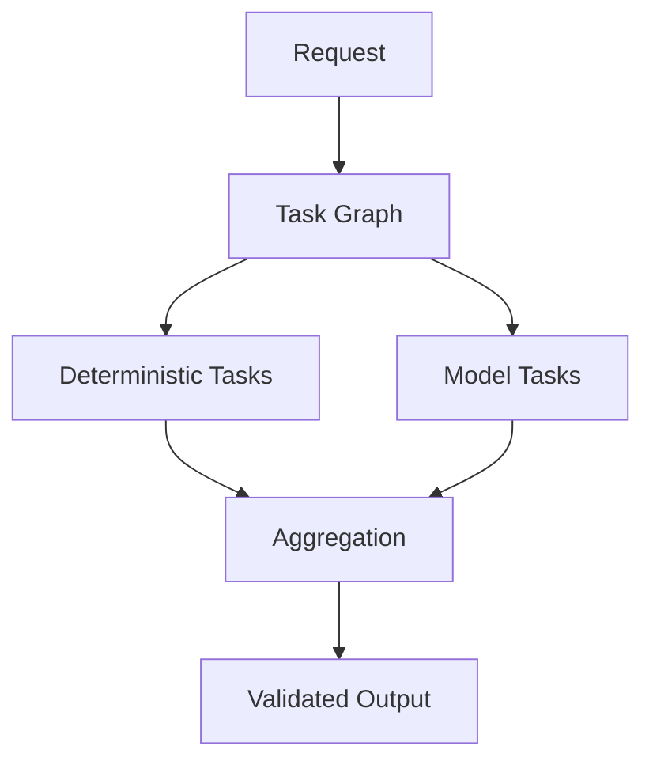

# KORA Executive Summary

KORA is an inference-first execution architecture.

It does not build larger models.  
It restructures how models are invoked.

---

## The Core Problem

Modern AI systems are inference-reflexive.

Every request triggers a model call.

This leads to:

- Unnecessary token usage
- Latency unpredictability
- Centralized infrastructure dependence
- Weak cost governance

The limitation is not model capability.

It is invocation discipline.

---

## The Structural Shift

KORA separates two decisions:

1. Does this request require reasoning?
2. If so, what is the reasoning result?

Most systems answer both by invoking a model.

KORA answers the first structurally.

Only necessary tasks reach inference.

---

## How It Works

KORA decomposes requests into atomic tasks.

Each task is:

- Typed
- Budget-bound
- Schema-validated
- Dependency-aware

Execution is graph-based, not prompt-based.

Deterministic tasks execute locally.  
Model tasks are invoked selectively.

---

## Key Architectural Guarantees

| Property | Meaning |
|-----------|---------|
| Deterministic-first | Trivial tasks never invoke model |
| Budget governance | max_tokens, max_time_ms enforced |
| Schema validation | Output must match explicit contract |
| Task isolation | Failures remain localized |
| Compute neutrality | Tasks may route across heterogeneous hardware |

Structure precedes scale.

---

## Economic Model

If:

- P = proportion of deterministic work
- C = cost per model invocation
- O = structural overhead

KORA is beneficial when:

P * C > O

This inequality is measurable.

Savings scale with structural visibility.

---

## Performance Implications

Latency becomes:

T_kora = T_overhead + (1 - P) * T_model

As deterministic coverage increases:

- Model load decreases
- Latency variance decreases
- Cost becomes predictable

Parallel deterministic execution further improves throughput.

---

## Decentralized Compute

Because tasks are atomic and bounded, they can be routed to:

- Local CPU
- Lightweight on-device models
- Remote LLM APIs
- Distributed nodes

Monolithic prompts centralize compute.

Atomic tasks enable distribution.

---

## Long-Term Direction

KORA prepares the path toward:

- Distributed CPU cloud execution
- Task-level routing across devices
- Decomposition-native foundation models
- Budget-aware reasoning systems

It does not compete with models.

It governs them.

---

## Why It Matters

As models grow larger:

- Token costs increase.
- Infrastructure centralizes.
- Latency variability increases.

Structure becomes more important, not less.

KORA ensures that:

- Inference is deliberate.
- Budgets are enforced.
- Structure survives scale.

---

## Positioning

KORA is not:

- A chatbot wrapper
- A prompt toolkit
- An agent playground

KORA is:

- An execution architecture
- A decomposition-native system
- A budget-governed reasoning fabric

---

## Final Thesis

Modern AI scales reasoning.

KORA scales discipline.

**Structure first.  
Inference second.**
