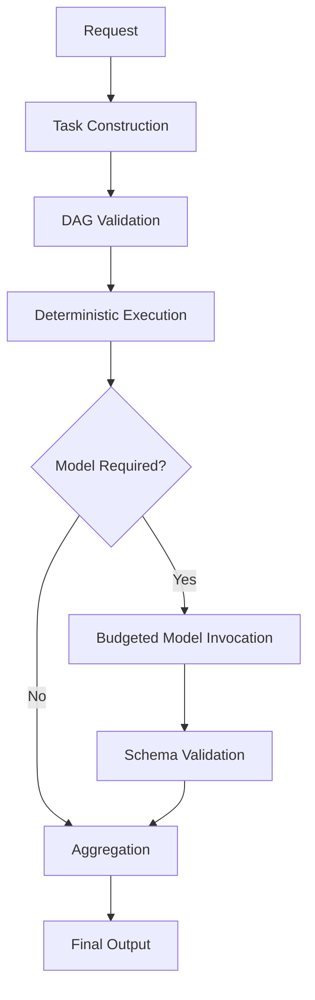

<p align="center">
  
</p>

<br>

<h1 align="center">KORA</h1>

<p align="center"><strong>Inference-First Execution Architecture</strong></p>
<p align="center">Deterministic-first execution that reduces unnecessary LLM calls.</p>

<p align="center">
  
  
  
  
  
</p>

<p align="center"><a href="docs/">Docs</a> · <a href="#quickstart">Quickstart</a> · <a href="docs/benchmark.md">Benchmarks</a> · <a href="studio/">Studio</a></p>

KORA is an execution architecture that structures intelligence before invoking large language models.

It does not replace models.  
It governs how and when they are used.

**Structure first.  
Inference second.**

---

## The Structural Problem

Most AI systems today are inference-reflexive.

A request arrives.  
A model is invoked.

The architecture rarely asks whether reasoning is necessary at all.

This reflex leads to:

- Unnecessary model calls
- Opaque cost scaling
- Latency volatility
- Centralized infrastructure dependency

The limitation is not model capability.

It is invocation discipline.

KORA separates necessity from reasoning.

---

## Core Principles

KORA is built on three structural principles:

### 1. **Determinism Before Inference**

Not every request requires probabilistic reasoning.
<br>Deterministic tasks execute locally and predictably.

Inference becomes escalation, not reflex.

---

### 2. **Native Decomposition**

Complex requests are decomposed into atomic tasks.

Each task is:

- Typed
- Bounded
- Schema-validated
- Independently executable

Reasoning becomes compositional rather than monolithic.

---

### 3. **Compute Neutrality**

KORA does not assume GPU centralization.

Tasks may execute across:

- CPUs
- Local lightweight models
- Remote LLM APIs
- Future NPUs

Heterogeneous compute is structural, not accidental.

---

## Architectural Overview



<br>
The model is one stage in execution, not the center of it.

---
## Runtime Boundary (v1)

KORA runtime is formally divided into four layers:

- IR Layer (task_ir.py)
- Execution Engine (scheduler.py, executor.py)
- Governance (budget.py, verification.py)
- Adapter Layer (adapters/*)

Each layer has strict dependency rules.

Full runtime specification:
docs/runtime-architecture.md
---

---

## Execution Guarantees

KORA enforces:

| Guarantee | Meaning |
|-----------|---------|
| Deterministic-first | Trivial tasks bypass inference |
| Budget governance | max_tokens, max_time_ms, max_retries enforced |
| Schema validation | Output must match explicit contract |
| Task isolation | Failures remain localized |
| Routing flexibility | Tasks may run on heterogeneous compute |

These are architectural constraints, not configuration options.

---

## Benchmark Snapshot

In controlled tests using `gpt-4o-mini`:

| Metric      | Direct | KORA | Reduction |
|-------------|--------|------|-----------|
| LLM Calls   | 2      | 1    | -50%      |
| Tokens In   | 359    | 225  | -37%      |
| Tokens Out  | 121    | 85   | -30%      |

Outputs were equivalent.

Structured execution reduced invocation frequency without degrading capability.

See `docs/benchmark.md`.

---

## Falsifiable Claim

KORA makes a measurable claim:

If a meaningful proportion of requests are deterministic or decomposable,  
then structured execution reduces model usage without reducing correctness.

This is experimentally testable.

See `docs/falsifiability.md`.

---

## Roadmap

### Phase 1 - Inference Minimization
Deterministic filtering.  
Budget enforcement.  
Schema validation.

### Phase 2 - Native Decomposition
Atomic task graphs.  
Selective routing.

### Phase 3 - Distributed Execution
Heterogeneous routing across devices.

### Phase 4 - Decomposition-Native Models
Alignment between model design and structural execution.

See `docs/dnfm-roadmap.md`.

---

## Naming

KORA is inspired by the West African instrument:
<br>
https://en.wikipedia.org/wiki/Kora_(instrument)

Like the instrument, the system:

- Is built from heterogeneous components
- Does not require industrial uniformity
- Produces coherence through structure

Toumani Diabaté:
<br>
https://en.wikipedia.org/wiki/Toumani_Diabat%C3%A9

demonstrated that disciplined structure enables layered complexity.

The analogy is architectural, not decorative.

---

## Quickstart

```bash
python3 -m venv .venv
source .venv/bin/activate
python3 -m pip install -e ".[dev]"
python3 examples/hello_kora/run.py
python3 examples/direct_vs_kora/run.py
```

---

## Documentation

- Philosophy: docs/philosophy.md
- Structural Critique: docs/structural-critique.md
- Architecture: docs/architecture.md
- Decomposition: docs/decomposition.md
- Decentralized Compute: docs/decentralized-compute.md
- Execution Model: docs/execution-model.md
- Budget: docs/budget.md
- Benchmark: docs/benchmark.md
- Break-Even Model: docs/break-even-model.md
- Falsifiability: docs/falsifiability.md
- Reasoning Adapter: docs/reasoning-adapter.md
- DNFM Roadmap: docs/dnfm-roadmap.md
- Naming: docs/naming.md

---

KORA does not eliminate reasoning.

It restores discipline to it.

**Structure governs scale.**
