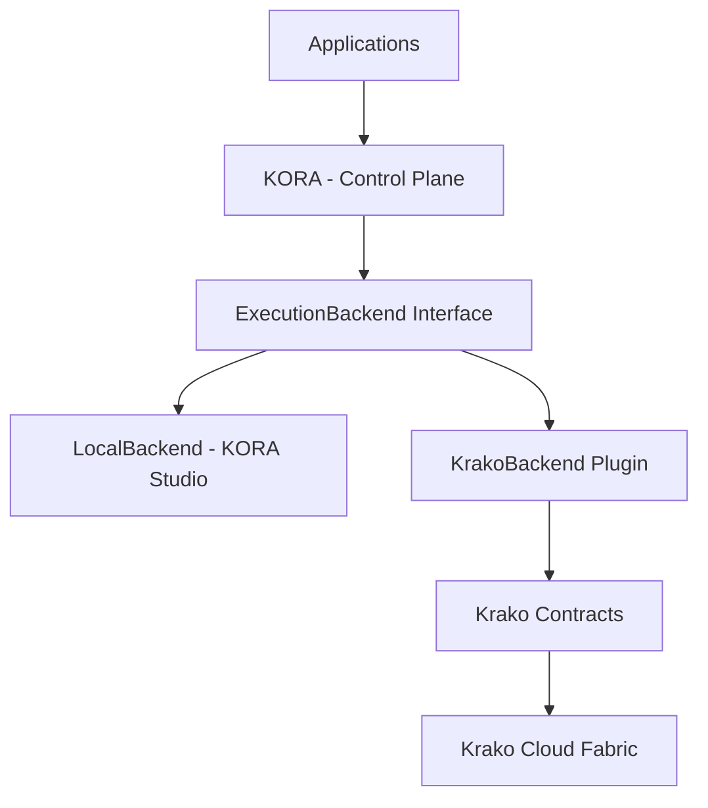

<p align="center">
  
</p>

<br>

<h1 align="center">KORA</h1>

<p align="center"><strong>Inference-First Execution Architecture</strong></p>
<p align="center">Deterministic-first execution that reduces unnecessary LLM calls and makes AI workloads measurable and governable.</p>

<p align="center">
  
  
  
  
  
  
</p>

<p align="center">
  <a href="docs/">Docs</a> ·
  <a href="#quickstart">Quickstart</a> ·
  <a href="docs/benchmark.md">Benchmarks</a> ·
  <a href="#kora-studio-and-krako-cloud">Studio &amp; Cloud</a>
</p>

---

# What KORA Does

Most AI applications are inference-reflexive: they call an LLM by default, for every request.

KORA changes the execution model. It makes structure first-class and treats inference as escalation, not reflex.

Instead of:

**User → Prompt → Model → Output**

KORA executes:

**User → TaskGraph →**
- deterministic CPU tasks (structure, rules, transforms)
- selective model tasks (only when necessary)
- strict schema validation
- bounded retries
- measurable telemetry
- deterministic aggregation

KORA does not replace models.
KORA governs how and when models are invoked.

---

# Why This Matters

Inference-reflexive systems tend to accumulate:

- unnecessary token usage (cost scales with volume)
- tail-latency volatility (no bounded execution envelope)
- weak governance (budget treated as tuning, not contract)
- fragile output parsing (schema treated as best-effort)
- centralized GPU dependence (monolithic prompts demand centralized compute)

KORA’s thesis is simple:

**Structure before scale.**
If a meaningful portion of workloads are deterministic or decomposable, structured execution reduces model usage without reducing correctness.

---

# KORA Studio and Krako Cloud

KORA is the semantic authority (execution intelligence).
Scaling is optional and provided by Krako Cloud.

## KORA Studio (Local-Only Runtime)

KORA Studio is the local product:

- runs entirely on a personal computer
- uses local CPU/GPU
- provides a ChatGPT-like local UI
- exposes a local developer API for building apps
- includes an Advanced Mode with TaskGraph + telemetry inspection
- works without any dependency on Krako Cloud

## Krako Cloud (Optional Scale)

Krako Cloud is the distributed execution fabric:

- large-model execution beyond local VRAM limits
- high concurrency and autoscaling
- event-sourced telemetry backbone
- replay-safe billing and trust (cloud-only)
- optional subscription / usage-based pricing

KORA Studio may use Krako Cloud via an optional backend plugin.
No automatic cloud switching is allowed. Cloud execution requires explicit user opt-in.

---

# Architecture Snapshot

KORA provides the control plane.
Execution happens through a backend interface:
<br><br>



<br><br>
- **KORA** defines semantics (what/why): Task IR, decomposition, stage semantics, budgets, schema contracts.
- **Backends** provide substrate (where/how): local CPU/GPU or distributed execution via Krako Cloud.
- **Contracts** are open and versioned; **fabric policies** are private.

See the full integrated diagram:
- `docs/specs/architecture/KORA_Krako_System_Architecture_Integrated_Diagram_v1.0.md`

---

# Core Principles (Non-Negotiable)

1. **Determinism Before Inference**
   If a task can be resolved deterministically, it must not invoke a model.

2. **Native Decomposition**
   Requests are decomposed into atomic tasks executed as a DAG.

3. **Budget as Contract**
   Every model task is bounded by explicit budget: `max_tokens`, `max_time_ms`, `max_retries`.

4. **Schema Validation Mandatory**
   Model output is accepted only if it satisfies strict schema validation.

5. **Observability Is Structural**
   Every task emits telemetry; retries and failures are never hidden.

---

# Benchmarks and Measured Results

KORA includes benchmark harnesses that compare:

- direct LLM invocation
- structured execution via KORA

## Benchmark Snapshot (Direct vs KORA)

Example stage timing evidence (seconds) from the existing harness:

| Case                | overall_total_s | llm_total_s | verify_total_s | overhead_s |
|---------------------|-----------------|-------------|----------------|------------|
| short               | 0.000754        | 0.000000    | 0.000725       | 0.000019   |
| long                | 2.134392        | 2.130928    | 0.003408       | 0.000039   |
| det_no_schema_short | 0.000017        | 0.000000    | 0.000000       | 0.000007   |

Interpretation:
- in LLM-dominant workloads, orchestration overhead is near-zero in absolute time
- deterministic tasks can bypass model calls entirely
- absolute time is more meaningful than overhead percentage for microsecond-scale paths

See:
- `docs/benchmark.md`

## Measured Results Example (Feb 17, 2026)

Long request benchmark (gpt-4o-mini):

Direct:
- tokens_in: 187
- tokens_out: 200
- cost: $0.00014805
- latency: 4003ms

KORA:
- tokens_in: 188
- tokens_out: 172
- cost: $0.00013140
- latency: 4577ms

Savings:
- $0.00001665 per request
- 11.25% estimated cost reduction

## Stress Test (1000 Sequential Runs)

- total_runs: 1000
- ok_runs: 950
- failed_runs: 50 (intentional exhaustion cohort)
- skipped_llm_runs: 748
- total_llm_calls: 202
- p95 latency: 1869ms
- p99 latency: 3112ms

This validates bounded execution and explicit failure contracts under stress.

See:
- `examples/stress_test/run.py`
- `docs/reports/` (generated outputs)

---

# Quickstart

## Install (editable)

```bash
python3 -m venv .venv
source .venv/bin/activate
python3 -m pip install -e ".[dev]"
```

## Run examples

```bash
python3 examples/hello_kora/run.py
python3 examples/direct_vs_kora/run.py
```

## Run real workload harness

```bash
python3 examples/real_workload_harness/run.py --mode direct --request "Summarize customer escalation risk."
python3 examples/real_workload_harness/run.py --mode kora --request "Summarize customer escalation risk."
```

---

# KORA Studio (Local UI)

KORA Studio is designed as a local-first application:

- chat UI (Basic Mode)
- telemetry + TaskGraph inspector (Advanced Mode)
- local API for developers

Official UX specs:
- `docs/specs/studio/KORA_Studio_UX_Wireframe_and_Interaction_Spec_v1.0.md`
- `docs/specs/studio/KORA_Studio_TaskGraph_Inspector_UI_Spec_v1.0.md`

---

# Developer API (Local + Cloud)

KORA provides a public API surface:

- local `/execute`, `/models`, `/health`, `/telemetry/{run_id}`
- cloud `/execute`, `/execution/{id}`, `/billing/usage`

See:
- `docs/specs/contracts/KORA_Public_API_Spec_v1.0.md`

---

# Docs Map

## Core docs (project-level)
- `docs/ARCHITECTURE-OVERVIEW.md`
- `docs/EXECUTIVE-SUMMARY.md`
- `docs/GOVERNANCE.md`
- `docs/VISION.md`

## Specs (contract + product)
- `docs/specs/studio/` (Studio UX, packaging, upgrade flow)
- `docs/specs/contracts/` (interfaces, mapping tables, public API)
- `docs/specs/governance/` (CI gates, migration plan, boundary locks)
- `docs/specs/architecture/` (integrated system diagrams)

---

# Contributing / Security / Roadmap

- Contributing: `CONTRIBUTING.md`
- Security: `SECURITY.md`
- Roadmap: `ROADMAP.md`

---

# License

KORA is open source under Apache 2.0.

Krako Cloud Fabric is proprietary (closed infrastructure).
Contracts remain open and versioned.

See:
- `docs/specs/governance/Licensing_and_Open_Core_Strategy_v1.0.md`
- `docs/specs/governance/Public_vs_Private_Responsibility_Matrix_v1.0.md`

---

**Structure first. Inference second. Scale when needed.**

