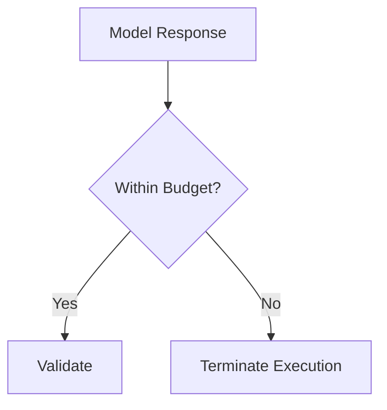

# Security

KORA is an execution architecture.

Security in KORA is not limited to code vulnerabilities.  
It includes structural safety around inference, decomposition, routing, and validation.

The goal is not only to prevent exploitation.  
The goal is to prevent architectural erosion.

---

## 1. Threat Model

KORA assumes the following threat surfaces:

- Prompt injection attempts
- Malicious model outputs
- Unbounded token abuse
- Retry amplification
- Routing manipulation
- Schema bypass attempts
- Resource exhaustion

Security mechanisms are embedded at structural boundaries.

---

## 2. Inference Boundary Security

All model invocations pass through the reasoning adapter.

This ensures:

- Budget enforcement
- Telemetry logging
- Schema validation
- Retry limits

**No direct model calls are permitted.**

This prevents silent bypass of governance.

---

## 3. Prompt Injection Mitigation

Prompt injection attacks attempt to override system instructions via input manipulation.

KORA mitigates this through:

- Task decomposition before reasoning
- Explicit system-level task construction
- Schema-constrained output
- Deterministic validation before aggregation

Because reasoning scope is isolated per task, injection cannot hijack full execution graph.

Atomic isolation reduces blast radius.

---

## 4. Schema Enforcement

All model outputs must pass strict schema validation:

- Valid JSON required
- Explicit type checks
- No additionalProperties
- Required fields enforced

Malformed outputs are rejected.

This prevents:

- Arbitrary code injection
- Unexpected data expansion
- Hidden reasoning artifacts

Validation is mandatory, not optional.

---

## 5. Budget Abuse Prevention

Attackers may attempt to:

- Trigger excessive token generation
- Force recursive retries
- Inflate latency

KORA enforces:

- max_tokens
- max_time_ms
- max_retries
- Global request ceilings
 

 
No inference continues beyond declared limits.

---

## 6. Retry Containment

Retries are bounded and structured.

Conditions for retry:

- Schema violation
- Timeout
- Model API failure

Retries are limited by max_retries.

No infinite recursion.

No cascading retry chains.

---

## 7. Routing Integrity

Routing decisions must not be user-controlled.

Routing logic:

- Is policy-driven
- Is internal to execution engine
- Must not accept user override flags

This prevents malicious redirection to higher-cost or weaker models.

---

## 8. Deterministic Layer Integrity

Deterministic tasks must remain pure.

Requirements:

- No side effects
- No dynamic code execution
- No implicit external calls

Deterministic layer must be:

- Predictable
- Isolated
- Fully auditable

---

## 9. Resource Isolation

Each request executes within bounded resource envelope.

Protections include:

- Per-task resource limits
- Global request ceilings
- Timeouts
- Memory constraints

Isolation prevents cross-request interference.

---

## 10. Logging and Audit

Security events are logged:

- Budget violations
- Retry exhaustion
- Schema failures
- Routing escalations
- Invocation anomalies

Logs must be:

- Immutable
- Structured
- Reviewable

Observability supports security auditing.

---

## 11. Model Risk Awareness

LLMs are probabilistic systems.

Risks include:

- Hallucination
- Policy bypass
- Unexpected format drift

KORA mitigates these through:

- Schema enforcement
- Output validation
- Task isolation
- Deterministic aggregation

Model risk is constrained structurally.

---

## 12. Secure Evolution

Security must evolve alongside architecture.

Any change that:

- Expands inference scope
- Reduces budget discipline
- Weakens validation
- Adds hidden model invocation

Must undergo security review.

Structure is security.

---

## Closing Position

Security in KORA is not layered on top.

It is embedded in structure.

- Determinism reduces attack surface.
- Decomposition limits blast radius.
- Budget governance prevents abuse.
- Schema validation prevents drift.
- Routing discipline prevents exploitation.

**Architecture is the primary defense.**
