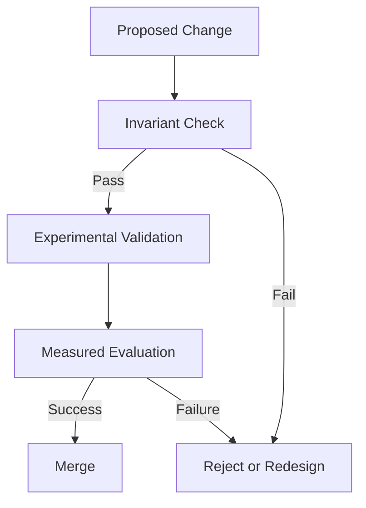

# Governance

KORA is not a feature-driven project.

It is an architectural system governed by structural invariants.
 Governance exists to preserve those invariants over time.

---

## 1. Architectural Authority

KORA is governed by principles, not popularity.

All decisions must preserve:

- **Determinism before inference**
- **Native decomposition**
- **Budget as contract**
- **Schema validation**
- **Compute neutrality**

If a proposal weakens any of these, it must be rejected or revised.

Architecture precedes expansion.

---

## 2. Invariants

The following properties are non-negotiable:

1. No hidden model invocation.
2. No unbounded inference.
3. No acceptance of unvalidated model output.
4. No bundling that obscures task boundaries.
5. No vendor lock-in.

These are structural invariants.

Changes that violate invariants require explicit architectural redesign, not incremental patching.

---

## 3. Change Control

All significant architectural changes must:

- Define the problem clearly.
- Identify affected invariants.
- Provide measurable before-and-after comparison.
- Define rollback conditions.

Large changes require staged integration.

No silent architectural drift.

---

## 4. Decision Model

KORA follows a discipline-first decision model:

1. Does this strengthen structure?
2. Does this preserve decomposition?
3. Does this maintain budget governance?
4. Does this improve measurability?

If the answer to any is unclear, the proposal requires revision.

Convenience is not sufficient justification.

---

## 5. Model Neutrality Protection

KORA must remain model-agnostic.

Governance must prevent:

- Hard-coded vendor coupling
- Implicit dependency on specific APIs
- Architecture shaped by single-model behavior

The reasoning adapter exists to preserve neutrality.

Neutrality is strategic.

---

## 6. Decentralization Protection

Governance must ensure that:

- CPU-first viability is preserved.
- Routing flexibility remains intact.
- Decomposition remains required.
- Centralized-only pathways are not introduced casually.

Centralization may be practical.

It must never become architectural assumption.

---

## 7. Budget Discipline

Budget governance is not configuration.

It is structural.

Governance must reject:

- Removal of retry limits
- Removal of token ceilings
- Silent escalation logic
- Unbounded recursive execution

Budget is a safeguard against architectural entropy.

---

## 8. Research Evolution

KORA evolves along two axes:

- Execution refinement
- Decomposition-native model research

DNFM direction must not compromise current structural discipline.

Research must remain falsifiable.

---

## 9. Governance Diagram

 
Governance is procedural.

It is not informal consensus.

---

## 10. Long-Term Stewardship

KORA is intended to:

- Remain minimal
- Remain measurable
- Remain decomposition-native
- Remain compute-neutral

Governance protects direction from drift.

---

## Closing Position

Architecture without governance decays.
 Governance without invariants becomes arbitrary.

KORA is governed by structure.

**Structure defines authority.**
