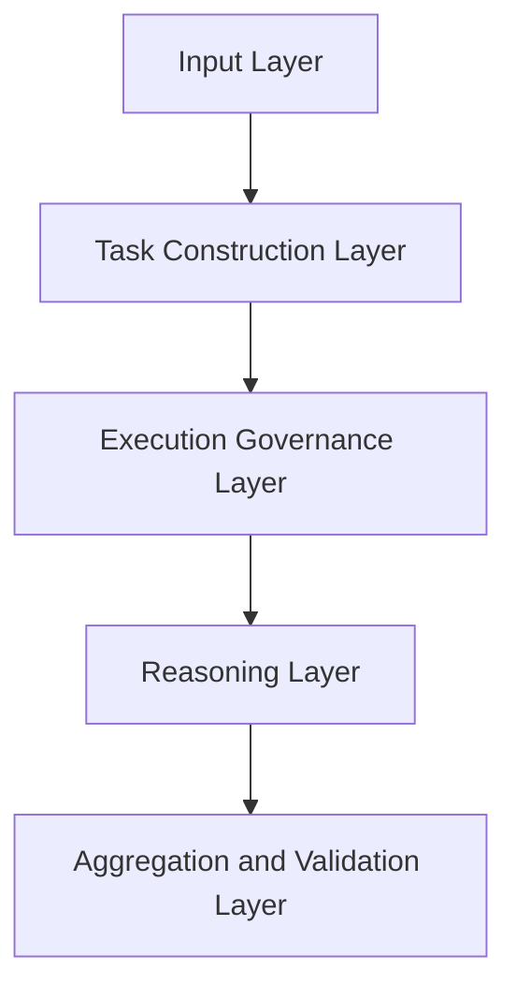
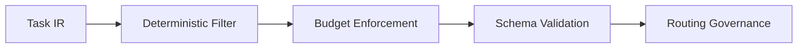
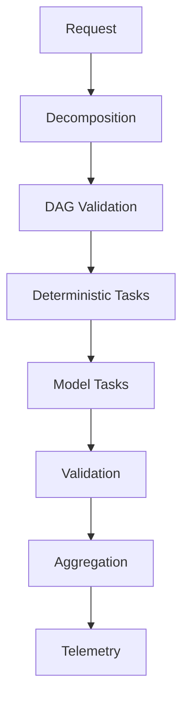

# Architecture Overview

This document provides a unified view of KORA.

Other documents explore specific dimensions.
 This document maps them into one coherent system.

---

## 1. Layered View

KORA consists of five structural layers.

Each layer enforces specific invariants.

No layer may bypass another.

---

## 2. Layer Responsibilities

| Layer | Responsibility | Related Documents |
|--------|----------------|-------------------|
| Input | Accept external request | README |
| Task Construction | Build Task IR | task-ir-spec.md |
| Execution Governance | DAG, budget, validation | execution-model.md, budget.md |
| Reasoning | Model invocation via adapter | reasoning-adapter.md |
| Aggregation | Deterministic composition | architecture.md |

This mapping prevents conceptual overlap.

---

## 3. Structural Control Points

KORA introduces control at four critical points:

1. Before inference
2. During inference
3. After inference
4. During routing

Each control point corresponds to a specific invariant.

---

## 4. Cross-Cutting Concerns

Some properties apply across all layers.

| Concern | Enforced By |
|----------|-------------|
| Deterministic-first | execution-model.md |
| Budget contract | budget.md |
| Schema validation | task-ir-spec.md |
| Observability | telemetry-and-observability.md |
| Distributed routing | distributed-execution-protocol.md |
| Governance discipline | governance.md |
| Version stability | versioning-and-evolution.md |

Cross-cutting concerns define system coherence.

---

## 5. Execution Lifecycle

 
Execution is structured and observable at each stage.

---

## 6. Economic Model Integration

The break-even condition:

P * C_m > O

Where:

- P = deterministic proportion
- C_m = model cost
- O = structural overhead

Economic viability depends on structure.

See break-even-model.md.

---

## 7. Performance Model Integration

Latency model:

T_kora = T_overhead + (1 - P) * T_model

Performance improves when deterministic coverage offsets overhead.

See performance-model.md.

---

## 8. Security and Trust Boundaries

Trust boundaries exist at:

- Task IR validation
- Schema validation
- Budget enforcement
- Routing policy

Security is embedded in structure.

See security.md.

---

## 9. Evolution Path

Future integration:

- Distributed execution
- CPU cloud routing
- Decomposition-native models

See dnfm-roadmap.md and distributed-execution-protocol.md.

---

## 10. System Invariants

The following must always hold:

- Determinism before inference
- Budget as contract
- Schema validation mandatory
- Task atomicity preserved
- Routing neutrality enforced
- Observability complete

These invariants are documented in design-principles.md.

---

## 11. Document Map

| Purpose | Document |
|----------|----------|
| Conceptual foundation | philosophy.md |
| Architectural critique | structural-critique.md |
| Execution structure | execution-model.md |
| Decomposition doctrine | decomposition.md |
| Compute neutrality | decentralized-compute.md |
| Economic modeling | break-even-model.md |
| Performance modeling | performance-model.md |
| Observability | telemetry-and-observability.md |
| Security | security.md |
| Governance | governance.md |
| Research direction | research-agenda.md |
| Roadmap | ROADMAP.md |
| Vision | VISION.md |

This overview binds them together.

---

## Closing Position

KORA is not a collection of documents.

It is a layered system.
 Each layer enforces discipline.
 Each document reinforces structure.

**Architecture is the organizing principle.**
