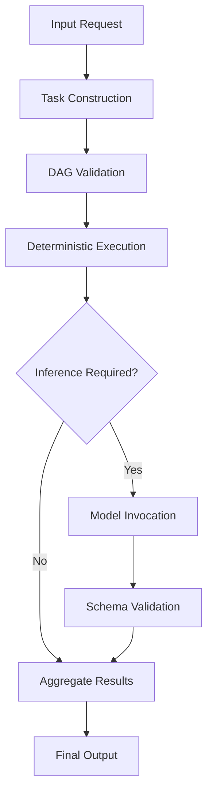

# Architecture

KORA is an **execution architecture** that enforces structural discipline before probabilistic reasoning.

It does not sit inside the model.  
It sits before the model.

The architecture exists to prevent inference reflexivity and to make decomposition native.

---

## 1. Architectural Premise

Most AI systems collapse three questions into one:

1. Is reasoning required?
2. What reasoning is required?
3. What is the answer?

They answer all three by invoking a model.

KORA separates these questions.

The architecture enforces a prior decision:

**Does this task require inference at all?**

Only after that decision does reasoning occur.

This separation is not cosmetic.  
It changes the entire execution model.

---

## 2. Task as First-Class Primitive

The smallest executable unit in KORA is a **Task**.

A task is not a prompt.  
A task is not a string.

A task is a structured execution object with explicit semantics.

### Task Schema

| Field        | Description |
|--------------|-------------|
| id           | Unique identifier |
| type         | deterministic or model |
| dependencies | Explicit upstream tasks |
| schema       | Output validation contract |
| budget       | max_tokens, max_time_ms, max_retries |
| metadata     | Observability data |

Because tasks are structured, they can be reasoned about *before* inference occurs.

This is how reflexivity is broken.

---

## 3. DAG-Based Execution

Tasks are composed into a **Directed Acyclic Graph**.

Execution proceeds through structural validation before computation.

### Execution Lifecycle

Execution is **graph-based**, not chain-based.

Graph structure enables:

- Native decomposition
- Parallel task execution
- Explicit reasoning boundaries
- Selective inference invocation

---

## 4. Deterministic Layer

The deterministic layer executes tasks that do not require probabilistic reasoning.

Examples:

- Arithmetic
- Static lookup
- Structural transformation
- Rule-based classification

These tasks never reach the model layer.

This is not optimization.  
It is structural enforcement.

**Determinism precedes inference.**

---

## 5. Model Layer

Only tasks explicitly marked as `model` are routed to inference.

Model invocation is:

- Budget-bound
- Schema-validated
- Retry-limited
- Telemetry-observed

Inference is isolated.

It is never ambient.

---

## 6. Budget Governance

Inference without bounds is architectural negligence.

Each model task must satisfy:

| Parameter     | Purpose |
|---------------|---------|
| max_tokens    | Upper bound on output length |
| max_time_ms   | Upper bound on latency |
| max_retries   | Retry ceiling |

Budget enforcement occurs:

- Before invocation
- During execution
- After validation

**Budget is contractual.**

---

## 7. Schema Validation

All model outputs must satisfy strict schema validation.

Requirements:

- Valid JSON
- Explicit typing
- No additionalProperties

If validation fails:

- Retry within budget
- Or fail deterministically

Verification replaces assumption.

---

## 8. Native Decomposition Engine

Incoming requests are decomposed into atomic tasks.

A complex request may produce:

- Deterministic subtasks
- Model-bound subt
