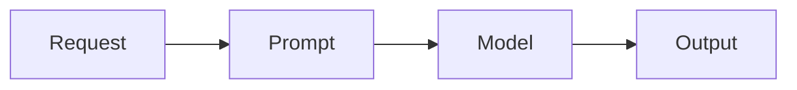
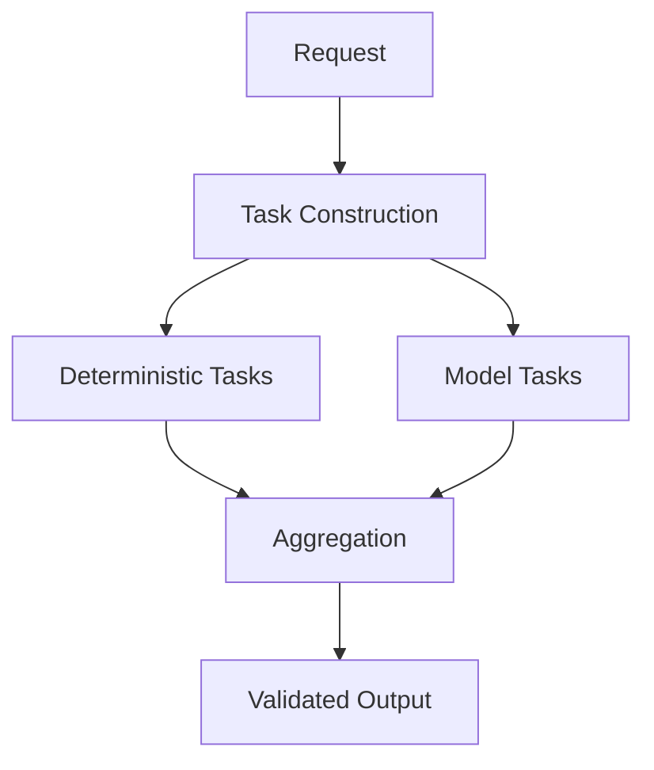

# Benchmark

The benchmark evaluates whether structured execution reduces model usage without degrading output quality.

The goal is not to prove superiority.
The goal is to measure structural impact.

---

## 1. Experimental Setup

Two execution paths were compared:

1. Direct model invocation
2. KORA structured execution

Both used the same underlying model.

### Model Used

- gpt-4o-mini

### Test Categories

- Short trivial request
- Longer reasoning request

Each request was executed under identical conditions.

---

## 2. Execution Flow Comparison

Evaluate KORA's ability to reduce unnecessary inference while preserving capability for complex tasks.

### Direct Invocation

### KORA Structured Execution

The difference is not model capability.
The difference is invocation discipline.

---

## 3. Aggregate Results

| Metric      | Direct | KORA | Reduction |
|-------------|--------|------|-----------|
| LLM Calls   | 2      | 1    | -50%      |
| Tokens In   | 359    | 225  | -37%      |
| Tokens Out  | 121    | 85   | -30%      |

All outputs were verified for correctness equivalence.

---

## 4. Interpretation

### Short Case

| Metric     | Direct | KORA |
|------------|--------|------|
| LLM Calls  | 1      | 0    |
| Tokens In  | 135    | 0    |
| Tokens Out | 41     | 0    |

The short request was entirely deterministic.

Direct system:

- Invoked model once.

KORA:

- Skipped inference entirely.

Result:

**Model invocation reduced to zero.**

This demonstrates elimination of unnecessary reasoning.

---

### Longer Case

| Metric     | Direct | KORA |
|------------|--------|------|
| LLM Calls  | 1      | 1    |
| Tokens In  | 224    | 225  |
| Tokens Out | 80     | 85   |

The longer request required reasoning.

Direct system:

- Invoked model for full prompt.

KORA:

- Decomposed request.
- Executed deterministic portions locally.
- Invoked model once for reasoning component only.

Result:

**Single controlled invocation instead of multiple implicit ones.**

Token reduction reflects structural filtering.

---

## 5. Token Reduction Analysis

| Metric     | Direct | KORA | Delta |
|------------|--------|------|-------|
| LLM Calls  | 2      | 1    | -50%  |
| Tokens In  | 359    | 225  | -37%  |
| Tokens Out | 121    | 85   | -30%  |

Token reduction emerges from:

- Removal of deterministic segments from prompt
- Reduced context window requirements
- Structured output enforcement

Decomposition shrinks reasoning scope.
Smaller scope means fewer tokens.

---

## 6. Latency Observation

Latency remained within equivalent bounds.
Deterministic execution introduced minimal overhead relative to model latency.
This suggests structural overhead did not dominate savings.

---

## 7. Cost Implications

If:

C = cost per model call

Savings per request:

C * P

Where P is deterministic proportion.

Even small P yields measurable savings.
Savings compound with scale.

---

## 8. Limitations

This benchmark is minimal.

It does not yet include:

- Large-scale datasets
- Distributed routing
- CPU cloud execution
- Edge-device trials

The purpose was proof of structural effect, not comprehensive evaluation.

---

## 9. Future Benchmark Expansion

Planned experiments:

- Larger dataset trials
- Deterministic coverage expansion
- Multi-model routing
- Edge execution tests
- Failure isolation metrics

Future benchmarks will test scalability of decomposition.

---

## 10. Empirical Position

The benchmark demonstrates:

- Model invocation reduction
- Token reduction
- Correctness preservation

It does not claim universal dominance.

It validates that structural execution changes invocation frequency.

**Structure measurably alters inference behavior.**
