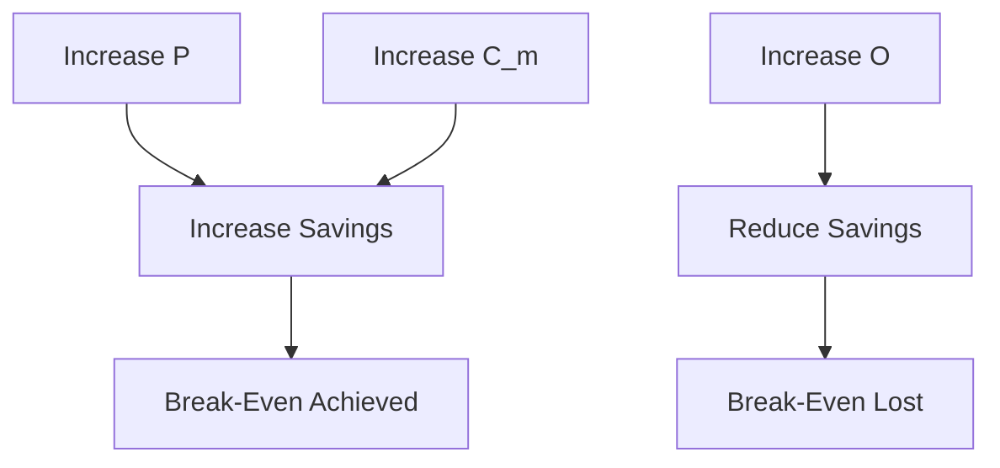

# Break-Even Model

KORA introduces structural overhead in order to reduce model invocations.

The break-even model formalizes when that tradeoff becomes advantageous.
 This document defines the economic boundary conditions of structured execution.

---

## 1. Variables

Let:

| Symbol | Meaning |
|--------|----------|
| T      | Total incoming requests |
| P      | Proportion of deterministic or decomposable components |
| C_m    | Cost per model invocation |
| C_d    | Cost per deterministic execution |
| O      | Structural overhead per request |
| L_m    | Latency per model invocation |
| L_d    | Latency per deterministic execution |

All costs are per-request averages.

---

## 2. Baseline System

In an inference-reflexive system:
 Every request triggers a model call.

Total cost:

C_baseline = C_m * T

Total latency:

L_baseline = L_m * T

There is no structural filtering.

---

## 3. Structured System

In KORA:

Only non-deterministic components invoke a model.

Total model cost:

C_model = C_m * (1 - P) * T

Total deterministic cost:

C_det = C_d * P * T

Total structural overhead:

C_overhead = O * T

Total cost:

C_kora = C_m * (1 - P) * T + C_d * P * T + O * T

---

## 4. Break-Even Condition

KORA is beneficial when:

C_kora < C_baseline

Substituting:

C_m * (1 - P) * T + C_d * P * T + O * T < C_m * T

Simplifying:

C_m - C_m * P + C_d * P + O < C_m

Rearranging:

P * (C_m - C_d) > O

This inequality defines the break-even threshold.

---

## 5. Interpretation

The inequality:

P * (C_m - C_d) > O

means:

The savings from replacing model calls with deterministic execution must exceed structural overhead.

Implications:

- Higher model cost increases KORA advantage.
- Higher deterministic cost reduces advantage.
- Larger P strengthens advantage.
- Larger O weakens advantage.

Break-even is not ideological.
It is arithmetic.

---

## 6. Latency Analysis

Baseline latency:

L_baseline = L_m * T

KORA latency:

L_kora = L_m * (1 - P) * T + L_d * P * T + L_structural * T

KORA improves latency when:

P * (L_m - L_d) > L_structural

Structure must not dominate execution time.

---

## 7. Sensitivity Analysis

### Effect of P

If P approaches 0:

KORA loses advantage.

If P approaches 1:

Model cost approaches zero.

### Effect of C_m

As model cost increases:
 Break-even becomes easier to achieve.

High-cost models strengthen KORA's economic case.

### Effect of O

If structural overhead grows:
 Break-even becomes harder.

Structural efficiency is critical.

---

## 8. Visual Model
 

  
Break-even is governed by three forces:

- Decomposable proportion
- Model cost
- Structural overhead

---

## 9. Practical Implications

The model suggests:

- Decomposition accuracy matters.
- Deterministic coverage must be maximized.
- Structural overhead must remain minimal.
- Budget enforcement must be efficient.

Poor decomposition increases overhead.
Poor routing reduces savings.
 
Structure must be efficient, not ceremonial.

---

## 10. Long-Term Economic Shape

In decentralized environments:

C_m may vary by routing path.
C_d may vary by device class.

Atomic tasks allow dynamic routing policies.
 
Break-even becomes adaptive rather than static.

---

## Closing Position

KORA does not claim universal superiority.

It claims conditional superiority under measurable economic conditions.
 
When decomposition is meaningful and structural overhead is controlled:

**Structure wins.**

When overhead dominates:
 
Structure must evolve.
 
The break-even model keeps the architecture honest.
