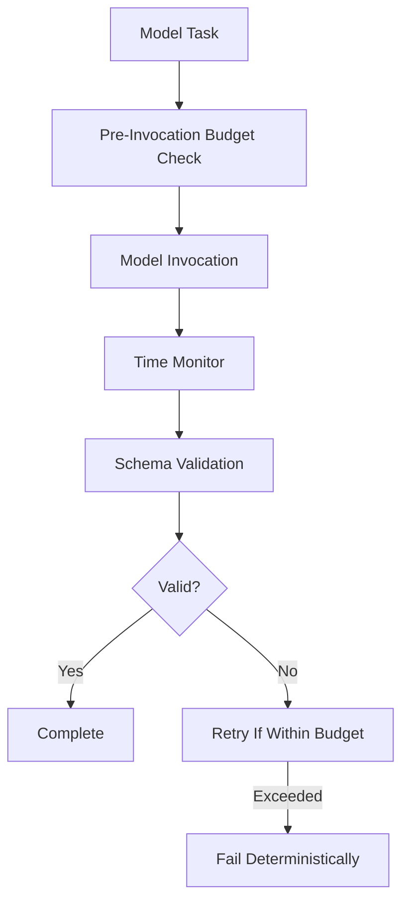

# Budget Governance

Budget governance is not a tuning parameter.

It is a structural constraint.

In inference-reflexive systems, model invocation is often unbounded.  
Token limits may exist, but they are treated as configuration, not architectural enforcement.

KORA treats budget as contract.

---

## 1. Why Budget Matters

Probabilistic reasoning without bounds introduces:

- Latency volatility
- Cost unpredictability
- Retry explosion
- Silent failure amplification

When inference is reflexive, resource usage becomes reactive.
 
KORA replaces reactive usage with governed execution.

---

## 2. Budget as Contract

Each model-bound task carries explicit constraints:

| Parameter     | Meaning |
|---------------|----------|
| max_tokens    | Maximum allowed output tokens |
| max_time_ms   | Maximum allowed latency |
| max_retries   | Maximum retry attempts |

These parameters are not advisory.

**They are enforced before, during, and after invocation.**

---

## 3. Enforcement Lifecycle

 
Budget enforcement exists at multiple checkpoints.

Inference cannot escape governance.

---

## 4. Pre-Invocation Controls

Before model invocation:

- Task must declare budget.
- Global system policy may adjust budget.
- Model selection may be restricted by budget.

If budget is insufficient:

- Task may downgrade model.
- Task may split further.
- Task may fail immediately.

This prevents runaway execution.

---

## 5. Runtime Controls

During invocation:

- Execution time is monitored.
- Token generation is capped.
- Partial output may be terminated.

Timeout is not exceptional.
It is expected governance.

---

## 6. Post-Invocation Controls

After model response:

- Output is validated.
- Retry count is incremented if necessary.
- Remaining budget is evaluated.

If retry budget is exhausted:

- Task fails.
- Aggregation handles failure deterministically.

No infinite retries.
No silent escalation.

---

## 7. Retry Policy

Retry logic must be bounded.

| Condition                | Action |
|--------------------------|--------|
| Schema violation         | Retry with correction prompt |
| Timeout                  | Retry if budget remains |
| Model error              | Retry with fallback model |
| Budget exhausted         | Deterministic failure |

Retries are structured, not recursive chaos.

---

## 8. Escalation Policy

If model fails within budget constraints:

- Task may escalate to larger model
- Or split into finer-grained tasks
- Or fail cleanly

Escalation must still respect global budget policy.

Governance survives escalation.

---

## 9. Budget and Decomposition

Decomposition improves budget control.

Smaller tasks:

- Require fewer tokens
- Have tighter latency bounds
- Fail independently
- Retry independently

Monolithic prompts make budget meaningless.

Atomic tasks make budget enforceable.

---

## 10. Budget and Compute Neutrality

Because tasks are bounded:

- Lightweight tasks can route to small models.
- Heavy tasks can escalate.
- Deterministic tasks remain on CPU.

Budget enables routing policy.

Routing policy enables decentralization.

---

## 11. Global vs Local Budget

Budget exists at two levels:

### Task-Level Budget
Applies to individual tasks.

### System-Level Budget
Applies across entire request lifecycle.

System-level constraints may include:

- Maximum cumulative token usage
- Maximum total latency
- Maximum total retries across graph

This prevents aggregate runaway behavior.

---

## 12. Observability and Auditing

Each task logs:

- Tokens used
- Time consumed
- Retries attempted
- Escalations performed

This enables:

- Budget auditing
- Policy refinement
- Experimental measurement

Budget must be visible to remain meaningful.

---

## 13. Structural Guarantees

Budget governance ensures:

- **No unbounded inference**
- **No silent retry loops**
- **No hidden cost amplification**
- **Predictable execution envelope**

Without budget, structure collapses.

---

## Closing Position

Inference is powerful.
 Unbounded inference is dangerous.
 KORA does not restrict reasoning arbitrarily.

It enforces reasoning responsibly.

**Budget defines discipline.  
Discipline enables scale.**
