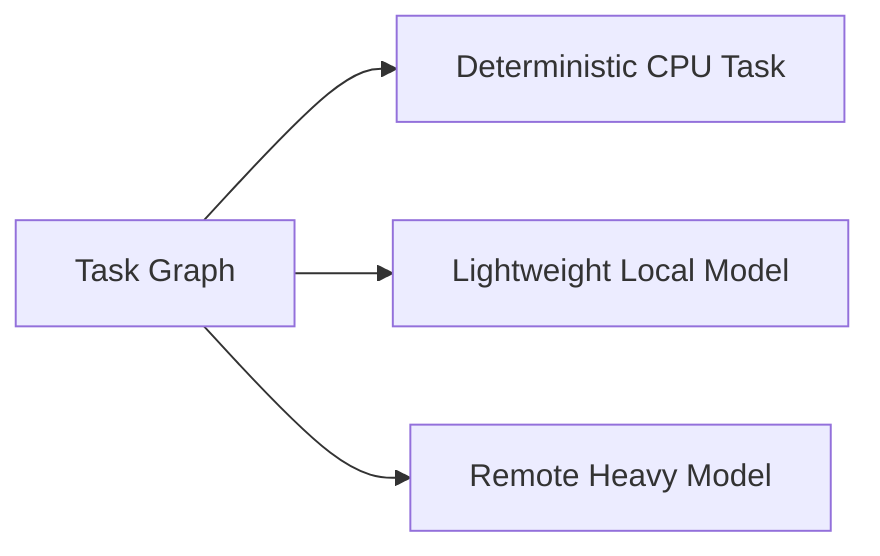
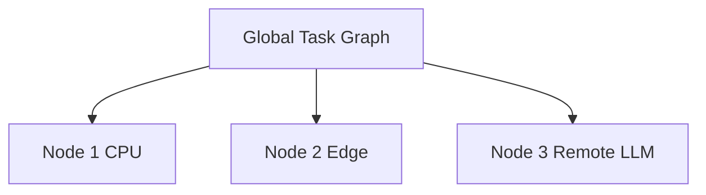

# Decentralized Compute

KORA is not only about reducing inference.

It is about changing where and how intelligence executes.

Modern AI infrastructure assumes GPU centralization. High-end accelerators become the default substrate for reasoning. Model invocation becomes tightly coupled to centralized hardware.

KORA rejects this assumption.

---

## 1. The Centralization Assumption

Today's dominant AI architecture assumes:

- Large models require specialized accelerators.
- Specialized accelerators are scarce and expensive.
- Inference must occur in centralized data centers.
- Capability scales with centralized hardware.

This creates structural consequences:

- Infrastructure concentration
- Vendor dependency
- Capital asymmetry
- Geographic imbalance
- Sovereignty risk

Centralization is not an accident. It is a direct result of monolithic inference design.

---

## 2. The Underutilized Substrate

Global CPU capacity is vast.

Billions of devices contain general-purpose processors capable of deterministic execution and lightweight reasoning. Yet most AI architectures ignore this substrate because they are built around large, monolithic model invocations.

When reasoning is bundled, routing becomes impossible.

Decomposition changes this.

---

## 3. Decomposition Enables Routing

When tasks are atomic and typed, they become movable.
 A single large prompt must run where the largest model exists.
 A graph of atomic tasks can be distributed.
 

 
This routing flexibility is not an optimization layer.

It is a structural consequence of native decomposition.

Without decomposition, decentralized compute is not feasible.

---

## 4. CPU as First-Class Citizen

In many systems, CPU is fallback.

In KORA, CPU is primary for deterministic tasks. 
Deterministic tasks often dominate request structure.

These include:

- Structural transformations
- Lookups
- Rule evaluations
- Aggregations

By executing these on CPU, the system:

- Reduces model load
- Reduces token consumption
- Reduces GPU dependency
- Increases routing flexibility

**CPU is not backup. It is structural foundation.**

---

## 5. Compute Neutrality

KORA does not bind tasks to specific hardware classes.

Because tasks are bounded and explicit, they can execute on:

- Local CPU
- Edge device
- On-device small models
- Remote APIs
- Future NPUs

Routing becomes policy-driven rather than hardware-driven.

This is compute neutrality.

Hardware is substrate, not authority.

---

## 6. Economic Implications

Centralized inference scales cost with usage. 
Decomposed routing scales cost with necessity.

Let:

- T be total requests
- P be deterministic proportion
- C_gpu be GPU inference cost
- C_cpu be CPU execution cost

Total cost:

C_total = (1 - P) * C_gpu * T + P * C_cpu * T

When P is significant, cost profile shifts dramatically.
 Decomposition changes economic shape.

---

## 7. Latency and Resilience

Centralized inference introduces:

- Network latency
- Data center dependency
- Congestion risk

Decentralized routing introduces:

- Local execution paths
- Parallel execution
- Failure isolation

Atomic tasks can fail independently.
 System resilience improves when reasoning is not monolithic.

---

## 8. Toward Distributed Execution Fabric

KORA prepares the foundation for:

- Distributed CPU clouds
- Cooperative device networks
- Edge execution graphs
- Sovereign AI infrastructures

Because tasks are atomic, routing can extend across machines.
 

 Execution becomes fabric-based rather than center-based.

---

## 9. Sovereignty and Control

When inference is centralized:

- Policy is centralized.
- Failure is centralized.
- Cost is centralized.

When execution is decomposed and routable:

- Policy becomes programmable.
- Cost becomes transparent.
- Infrastructure becomes flexible.

Decentralization is not ideological.

It is architectural control.

---

## 10. Long-Term Direction

Native decomposition plus compute neutrality enables:

- Device-level inference participation
- CPU-first distributed reasoning
- Reduced accelerator dependency
- Decomposition-Native Foundation Model integration

Decentralization is not an add-on.

It emerges naturally when structure precedes scale.

---

## Closing Position

Centralization emerges from monolithic inference.
 Decentralization emerges from structured decomposition.

KORA chooses structure.

**Compute is substrate.  
Structure is authority.**
