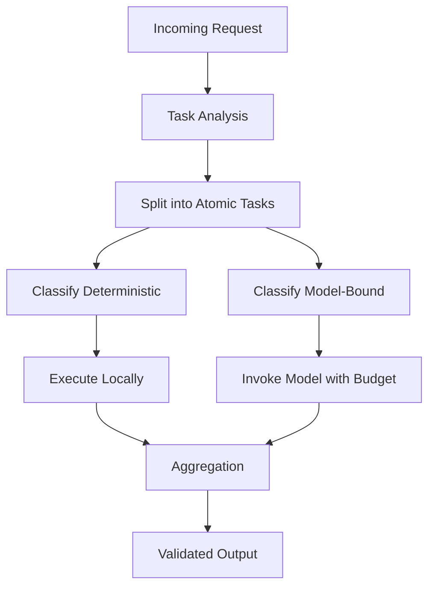
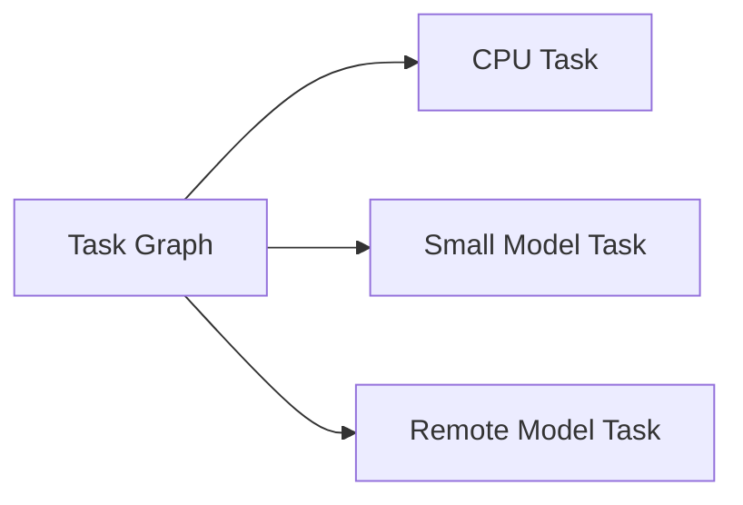

# Native Decomposition

Decomposition in KORA is not an optimization.

It is a structural principle.

Modern prompting culture encourages bundling. Complex instructions are packed into a single prompt and passed to a single model invocation. Capability is demonstrated through monolithic reasoning.

KORA rejects this assumption.

---

## 1. The Problem with Monolithic Prompts

A large prompt typically contains multiple hidden layers:

- Deterministic operations
- Structural transformations
- Reasoning components
- Output formatting

When treated as a single reasoning unit:

- Cost becomes opaque
- Execution becomes unbounded
- Validation becomes fragile
- Routing becomes impossible

A monolithic prompt hides structure.

Hidden structure cannot be governed.

---

## 2. Decomposition as First Principle

KORA treats every request as decomposable.

Each request is broken into atomic tasks.

A task must be:

- Explicitly typed
- Explicitly bounded
- Explicitly dependent
- Explicitly validated

This makes structure visible.

Visible structure can be governed.

---

## 3. Atomic Task Model

An atomic task satisfies:

- A single execution responsibility
- A clear input boundary
- A clear output schema
- A bounded resource envelope

Atomicity enables:

- Selective inference
- Selective routing
- Parallel execution
- Deterministic pruning

Atomic tasks are the foundation of structural intelligence.

---

## 4. Decomposition Workflow

Decomposition precedes execution.

Execution never precedes classification.

---

## 5. Cost Implications

Decomposition reduces model-bound workload.

Let:

- T be total requests
- P be proportion of trivial or deterministic components
- C be cost per model invocation

Monolithic system cost:

C * T

Decomposed system cost:

C * (1 - P) * T

Savings:

C * P * T

This reduction scales with structural visibility.

Decomposition is economic architecture.

---

## 6. Latency Implications

Monolithic reasoning produces latency variance.

Atomic tasks allow:

- Parallel deterministic execution
- Bounded inference tasks
- Selective retries

Latency becomes predictable.

Predictability is structural.

---

## 7. Decomposition and Compute Routing

Without decomposition, routing is impossible.

A single large prompt must execute on a large model.

With decomposition:

- Deterministic tasks can run on CPU
- Lightweight reasoning tasks can run on small local models
- Heavy reasoning tasks can be escalated

Decomposition enables heterogeneity.

---

## 8. Decomposition and Validation

Atomic tasks allow atomic validation.

Instead of validating one opaque block, the system validates:

- Each reasoning compone
