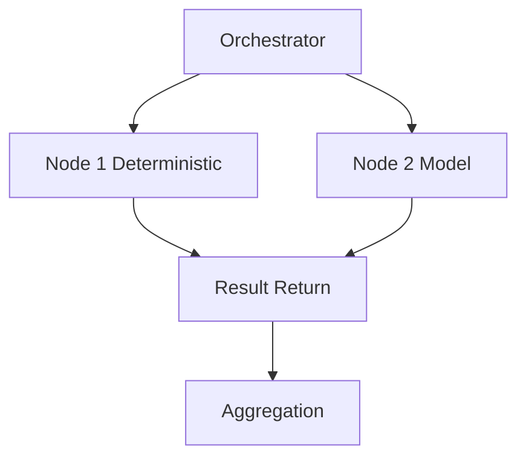
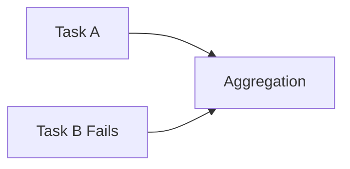

# Distributed Execution Protocol

KORA's architecture enables atomic task routing.

This document defines the protocol required to execute Task IR across multiple nodes. Distributed execution is optional.

It must not compromise structural invariants.

---

## 1. Node Model

Each node in the network may perform one or more of:

- Deterministic execution
- Lightweight model inference
- Heavy model inference
- Aggregation

Nodes do not execute arbitrary prompts.

They execute **Task IR objects**.

---

## 2. Execution Roles

| Role | Responsibility |
|-------|---------------|
| Orchestrator | Builds DAG, assigns tasks |
| Worker Node | Executes deterministic or model tasks |
| Validator | Performs schema validation |
| Aggregator | Combines results |

Roles may coexist on a single machine.

---

## 3. Task Serialization

Tasks are serialized in JSON.

Example distributed payload:

```json
{
  "task": { ... Task IR ... },
  "signature": "optional",
  "origin_node": "node-id",
  "trace_id": "request-id"
}
```

Serialization must preserve:

- Task id
- Dependencies
- Budget constraints
- Schema contract

Nodes must not modify Task IR fields arbitrarily.

---

## 4. Execution Flow



Execution is coordinated by orchestrator.

Nodes remain stateless with respect to global graph.

---

## 5. Trust Model

Distributed execution introduces trust considerations.

Minimum trust assumptions:

- Nodes must respect declared budget.
- Nodes must return structured output.
- Nodes must not escalate model without permission.

Trust may be enforced through:

- Cryptographic signatures
- Node identity verification
- Result hashing

Trust enforcement mechanism is policy-dependent.

---

## 6. Budget Preservation Across Nodes

Budget is carried with each task.

Nodes must enforce:

- max_tokens
- max_time_ms
- max_retries

Nodes must not increase budget.

Budget may only decrease.

**Budget invariants must hold globally.**

---

## 7. Routing Policy

Routing decisions are made by orchestrator.

Nodes must not self-select heavier models.

Routing may consider:

- Node capabilities
- Current load
- Latency requirements
- Cost constraints

Routing is deterministic policy, not node preference.

---

## 8. Failure Handling

Failure types:

| Type | Description |
|-------|------------|
| NodeFailure | Node unreachable |
| TaskFailure | Execution error |
| ValidationFailure | Schema mismatch |
| TimeoutFailure | max_time_ms exceeded |

Failure protocol:

1. Orchestrator detects failure.
2. Budget evaluated.
3. Retry on alternate node if allowed.
4. Otherwise fail task deterministically.

Failure must not cascade across graph.

---

## 9. Partial Execution and Isolation

Atomic tasks allow partial graph completion.

If one node fails:

- Only affected tasks are retried.
- Other tasks proceed.
- Aggregation waits only for required dependencies.



Failure isolation is structural benefit of decomposition.

---

## 10. Telemetry Aggregation

Distributed telemetry must include:

- Node id
- Execution duration
- Model usage
- Retry count
- Failure type

Telemetry must propagate to orchestrator.

Central visibility is required for falsifiability.

---

## 11. Message Types

Minimum protocol messages:

| Message | Purpose |
|----------|---------|
| TaskDispatch | Send Task IR to node |
| TaskResult | Return result payload |
| TaskFailure | Return failure metadata |
| Heartbeat | Node liveness check |
| CapabilityReport | Node execution capabilities |

Protocol must remain minimal.

---

## 12. Capability Advertisement

Nodes must declare:

- Supported task types
- Supported model backends
- Max resource limits
- Execution class (CPU, GPU, edge)

Example:

```json
{
  "node_id": "node-1",
  "capabilities": {
    "deterministic": true,
    "model_types": ["small", "large"],
    "max_tokens": 2048
  }
}
```

Routing decisions depend on capability accuracy.

---

## 13. Security Considerations

Distributed execution increases attack surface.

Mitigations:

- Node authentication
- Task signature verification
- Encrypted transport
- Result validation on orchestrator
- Strict schema enforcement

Nodes must never be trusted implicitly.

---

## 14. Scalability Model

Distributed scalability improves when:

- Deterministic proportion is high.
- Tasks are independent.
- Network overhead is bounded.

If network latency dominates:

Structural benefit may diminish.

Distribution is conditional, not assumed.

---

## 15. Invariants

The distributed protocol must preserve:

- **Task atomicity**
- **Budget enforcement**
- **Schema validation**
- **Routing authority at orchestrator**
- **Failure isolation**

If distribution weakens these, it violates architecture.

---

## Closing Position

KORA can operate locally. It can scale across nodes.

But distribution must not erode structure. Compute may distribute.
<br>Governance must remain centralized at orchestration layer.

**Distribution extends structure.  
It does not replace it.**
