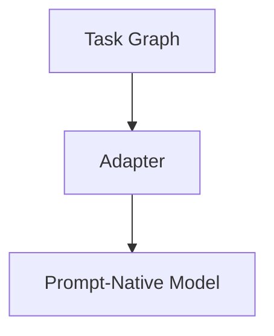
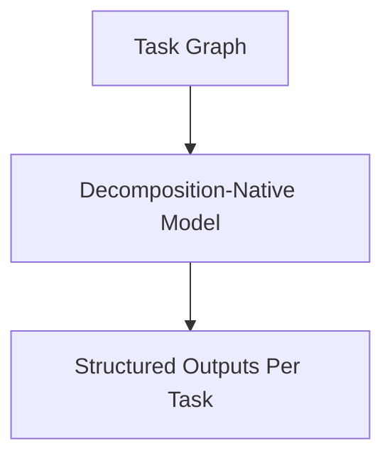
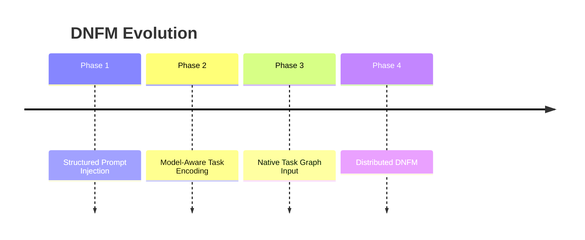

# DNFM Roadmap

KORA today is an execution architecture.

Its long-term trajectory points toward a deeper integration between decomposition and model design. This direction is referred to as **Decomposition-Native Foundation Models**, or DNFM.

DNFM is not implemented.

It is a research direction implied by KORA's structural principles.

---

## 1. Motivation

Current foundation models are prompt-native.

They accept large text inputs and produce large text outputs.

They assume:

- Monolithic reasoning
- Implicit task bundling
- External orchestration

KORA demonstrates that reasoning benefits from structural separation.

The natural question emerges:

What would a foundation model look like if it were designed around decomposition from the start?

---

## 2. Prompt-Native vs Decomposition-Native

| Prompt-Native Model | Decomposition-Native Model |
|---------------------|----------------------------|
| Accepts single prompt | Accepts structured task graph |
| Implicit reasoning boundaries | Explicit task boundaries |
| Unbounded reasoning scope | Task-scoped reasoning |
| External validation | Integrated schema awareness |
| Monolithic execution | Composable execution |

DNFM proposes moving structure closer to the model.

---

## 3. Architectural Shift

In current KORA:

In a DNFM future:

 
The model itself understands task boundaries.

Execution and reasoning become aligned.

---

## 4. Research Questions

DNFM introduces several open questions:

- Can models accept structured graph input?
- Can models produce task-scoped reasoning segments?
- Can budget awareness be embedded natively?
- Can output schemas be enforced internally?

These are model-design questions, not orchestration questions.

---

## 5. Intermediate Milestones

DNFM is not an immediate leap.
 It evolves through staged integration.

### Phase 1 - Structured Prompt Injection

- Embed task boundaries explicitly in prompt
- Enforce task-level output segmentation
- Collect telemetry on reasoning isolation

### Phase 2 - Model-Aware Task Encoding

- Introduce structured JSON graph input
- Encourage model to reason per-node
- Evaluate partial execution consistency

### Phase 3 - Native Task Graph Input

- Model directly consumes DAG representation
- Model produces node-scoped outputs
- Budget constraints embedded in generation loop

### Phase 4 - Distributed DNFM

- Task graph processed across heterogeneous nodes
- Model instances coordinate per-task reasoning
- Decomposition and routing become model-level primitives

---

## 6. Economic and Architectural Impact

DNFM could:

- Reduce token bundling overhead
- Improve reasoning isolation
- Improve retry localization
- Enable tighter budget integration
- Improve routing predictability

It would not eliminate orchestration.

It would align orchestration and reasoning.

---

## 7. Relationship to Decentralization

Prompt-native models encourage centralization.

DNFM models could:

- Accept smaller reasoning units
- Run efficiently on lighter hardware
- Support partial execution distribution
- Align with CPU-first routing

Decomposition-native reasoning supports decentralized compute.

---

## 8. Research Risks

DNFM may fail if:

- Structured input degrades model reasoning quality
- Task isolation reduces coherence
- Budget awareness constrains creativity excessively

These risks must be empirically evaluated.

DNFM is not guaranteed success.

---

## 9. Timeline Overview

The roadmap is evolutionary, not disruptive.

---

## 10. Positioning

KORA today:

- Enforces decomposition externally
- Governs inference through architecture
- Routes reasoning across heterogeneous compute

DNFM future:

- Integrates decomposition into model design
- Aligns reasoning with structure
- Reduces gap between orchestration and inference

---

## Closing Position

KORA does not depend on DNFM.

But DNFM emerges naturally from KORA's philosophy.

If structure precedes scale,
then model design must eventually reflect structure.

**Decomposition today is architectural.  
Tomorrow it may be foundational.**
