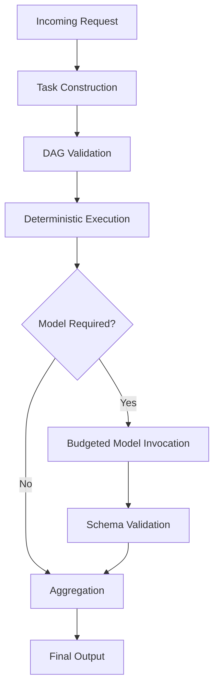
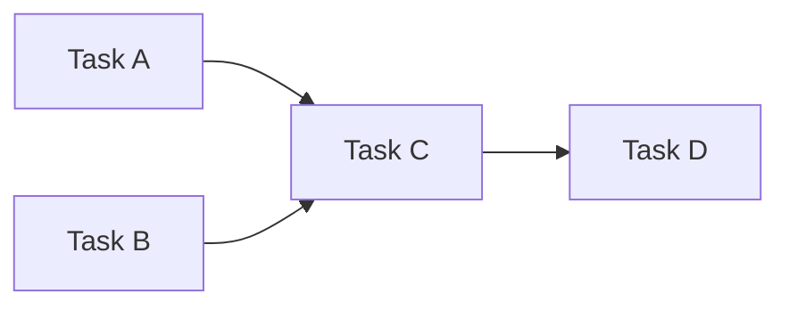
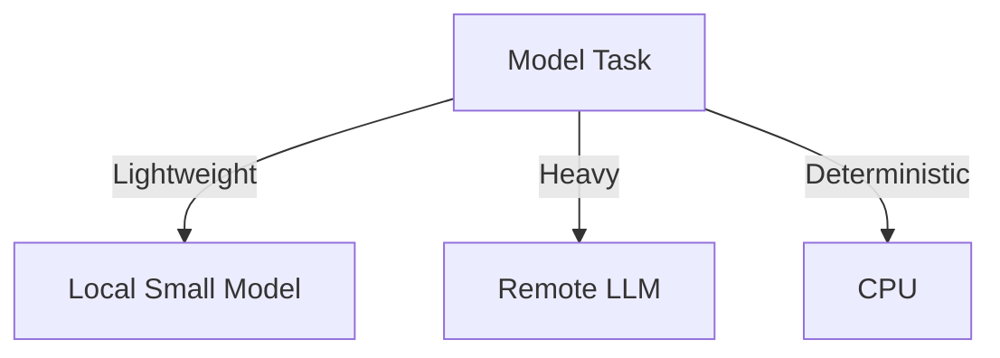

# Execution Model

The execution model of KORA operationalizes its philosophy.

It defines how structure is enforced, how inference is bounded,  
and how decomposition becomes native rather than optional.

Execution is not a single step.
 Execution is a sequence of structurally enforced stages.

---

## 1. High-Level Flow
 

 The model is not the center of execution.
 It is one stage among many.

---

## 2. Stage 1 - Task Construction

Incoming requests are parsed into structured **Task IR** objects.

Each task is:

- Typed
- Bounded
- Dependent on explicit inputs
- Attached to an output schema

This stage transforms unstructured input into governable structure.

*Without this transformation, discipline is impossible.*

---

## 3. Stage 2 - Graph Validation

Tasks are assembled into a Directed Acyclic Graph.

Validation includes:

- Cycle detection
- Dependency resolution
- Topological ordering
  

 
Graph structure enables:

- Parallel execution
- Isolation of reasoning components
- Explicit control over dependency chains

Execution is **graph-driven**, not prompt-driven.

---

## 4. Stage 3 - Deterministic Execution

All tasks marked as deterministic are executed first.

Deterministic tasks include:

- Arithmetic
- Lookup
- Structural transformation
- Rule evaluation
- Aggregation

These tasks:

- Never invoke a model
- Have bounded execution time
- Are fully reproducible

This stage reduces model load before reasoning begins.

**Determinism precedes inference.**

---

## 5. Stage 4 - Necessity Check

After deterministic execution, the system evaluates:
 Does any unresolved task require model reasoning?

If no, execution completes.
 If yes, only those tasks escalate.

This stage breaks inference reflexivity.

---

## 6. Stage 5 - Budgeted Model Invocation

Model-bound tasks are executed under strict constraints.

| Constraint     | Description |
|----------------|-------------|
| max_tokens     | Upper bound on output size |
| max_time_ms    | Latency limit |
| max_retries    | Retry ceiling |

Budgets are enforced:

- Pre-invocation
- During execution
- Post-response

Model invocation is never unbounded.

**Budget is contractual.**

---

## 7. Stage 6 - Schema Validation

All model outputs must pass strict validation.

Validation checks:

- Valid JSON
- Explicit typing
- No additionalProperties
- Required fields present

If validation fails:

- Retry within budget
- Or fail deterministically

Trust is replaced by structure.

---

## 8. Stage 7 - Aggregation

Aggregation tasks combine:

- Deterministic outputs
- Model outputs
- Intermediate results

Aggregation is itself deterministic.

This ensures final output structure remains governed.

---

## 9. Observability and Telemetry

Each stage emits telemetry.

| Metric                  | Purpose |
|--------------------------|----------|
| Task execution time      | Latency analysis |
| Model invocation count   | Cost tracking |
| Token usage              | Budget auditing |
| Retry attempts           | Stability monitoring |
| Validation failures      | Structural integrity |

Observability enables falsifiability.

Without telemetry, structure cannot be measured.

---

## 10. Routing Layer

Because tasks are atomic, routing decisions can be made per task.
  

  Routing criteria may include:

- Budget limits
- Latency requirements
- Model capability
- Cost policies

Routing is structural, not heuristic.

---

## 11. Failure Isolation

Monolithic prompts fail monolithically.

Atomic task graphs fail locally.

If one task fails:

- It can retry independently
- It can escalate independently
- It can fail without collapsing entire execution

Failure isolation increases resilience.

---

## 12. Structural Guarantees

The execution model guarantees:

- Deterministic-first processing
- Selective model invocation
- Explicit budget enforcement
- Schema-validated outputs
- Task-level observability
- Heterogeneous routing capability

These are architectural invariants.

They are not runtime suggestions.

---

## 13. Relationship to Decomposition

Execution model and decomposition are inseparable.

Decomposition produces atomic tasks.  
Execution model governs their lifecycle.

Without decomposition, execution collapses into reflex.  
Without execution discipline, decomposition becomes cosmetic.

Together, they form structural intelligence.

---

## Closing Position

The execution model ensures that:

- Structure precedes reasoning
- Necessity precedes inference
- Governance precedes scale

KORA does not eliminate models.

It surrounds them with architecture.

**Reason only when required.  
Scale only what is structured.**
