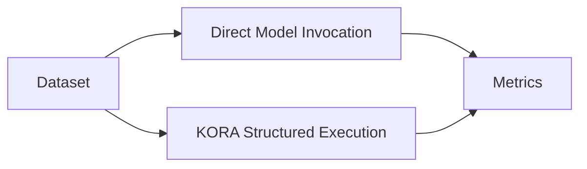

# Falsifiability

KORA is not a belief system.

It makes a measurable architectural claim.
 If that claim fails under experiment, KORA fails.

---

## 1. Core Hypothesis

The central hypothesis of KORA is:

**If a meaningful proportion of requests are trivial or decomposable,  then structured execution reduces model invocations without reducing capability.**

This is not philosophical.

It is testable.

---

## 2. Definitions

Let:

| Symbol | Meaning |
|--------|----------|
| T      | Total incoming requests |
| P      | Proportion of deterministic or decomposable components |
| C      | Cost per model invocation |
| L      | Average latency per model invocation |

We assume that P > 0 for most real-world systems.

---

## 3. Baseline System

In an inference-reflexive system:
 Every request triggers a model call.

Total model invocations:

T

Total cost:

C * T

Total reasoning latency:

L * T

There is no structural filtering.

---

## 4. Structured System

In a decomposition-native system:
 Only non-deterministic components invoke a model.

Total model invocations:

(1 - P) * T

Total cost:

C * (1 - P) * T

Total reasoning latency:

L * (1 - P) * T

Cost and latency scale with necessity, not volume.

---

## 5. Experimental Design

A minimal experiment must include:

1. A representative request dataset
2. A decomposition engine
3. A deterministic layer
4. A budget-bound model layer
5. Capability equivalence measurement

Execution comparison:
  

  
Metrics collected:

- Model invocation count
- Total token usage
- Total latency
- Output correctness

---

## 6. Success Conditions

KORA is validated if:

- Model invocations decrease
- Token usage decreases
- Latency decreases or remains stable
- Output correctness remains equivalent

Correctness must not degrade.

Reduction without capability preservation is failure.

---

## 7. Failure Conditions

KORA fails if:

- Decomposition overhead outweighs savings
- Model invocation count does not decrease
- Latency increases beyond acceptable margin
- Output correctness declines

The hypothesis must survive empirical testing.

---

## 8. Measurable Variables

To ensure rigor, experiments must record:

| Metric                     | Purpose |
|----------------------------|----------|
| Invocation count           | Measure reflexivity reduction |
| Token usage                | Measure cost efficiency |
| Task execution time        | Measure structural overhead |
| Retry frequency            | Measure instability |
| Output equivalence score   | Measure correctness preservation |

Structure must be measurable.

---

## 9. Overhead Consideration

Decomposition introduces overhead:

- Task construction
- DAG validation
- Schema validation

This overhead must remain bounded.

Let:

O be structural overhead per request.

Total cost becomes:

C * (1 - P) * T + O * T

KORA is beneficial when:

C * P > O

This inequality is testable.

---

## 10. Long-Term Experimental Expansion

Future experiments may include:

- Distributed CPU routing tests
- Small-model substitution trials
- Edge execution scenarios
- Partial network failure resilience

The hypothesis extends beyond token reduction.

It includes structural resilience.

---

## Closing Position

KORA does not claim universal superiority.

It claims conditional superiority under measurable assumptions.
 If those assumptions fail, the architecture must adapt.

**Structure must survive experiment.**
