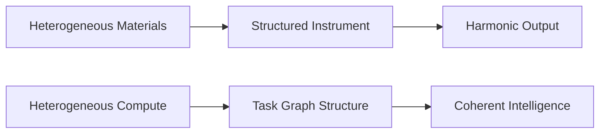

# Naming

The name **KORA** is not symbolic decoration.
 It is structural analogy.

---

## 1. The Instrument

The kora is a West African stringed instrument: 
https://en.wikipedia.org/wiki/Kora_(instrument)

It is traditionally built from available materials:

- Calabash body
- Wooden neck
- String assembly
- No rigid industrial standard

Each kora may differ in construction.

Yet structural tension and string arrangement produce harmonic coherence.
 Variation does not destroy harmony.

Structure enables it.

---

## 2. Toumani Diabaté

Toumani Diabaté:
 https://en.wikipedia.org/wiki/Toumani_Diabat%C3%A9

demonstrated how disciplined mastery of the kora allows layered 
complexity from a structurally constrained instrument.

Multiple melodic lines can emerge from a single structured system.
 Complexity emerges from composition, not excess.

This is the architectural parallel.

---

## 3. Structural Mapping

| Kora Instrument Property | Architectural Correspondence |
|---------------------------|------------------------------|
| Built from available materials | Built from heterogeneous compute |
| No rigid industrial standard | No hardware dependency |
| Structural tension governs harmony | Task graph governs execution |
| Variation without collapse | Model neutrality |
| Manual mastery required | Architectural discipline required |

The analogy is structural, not aesthetic.

---

## 4. Heterogeneity and Harmony

The kora does not require uniformity to function.

It tolerates:

- Material variation
- Craft variation
- Tuning variation

Yet structure holds.

KORA operates similarly.

Execution may span:

- CPU nodes
- Local models
- Remote models
- Edge devices

Heterogeneous compute does not destroy coherence.

Structured orchestration preserves it.

---

## 5. Structure Before Scale

The kora produces layered sound without amplification of material complexity.
 The architecture produces layered reasoning without amplification of model invocation.

The analogy is precise:

Structure governs output more than scale.

---

## 6. Diagrammatic Parallel

 
Structure mediates heterogeneity.

---

## 7. Not a Metaphor of Elegance

The name KORA is not chosen for poetic effect.

It encodes three architectural positions:

- Compute may be heterogeneous.
- Structure must be explicit.
- Harmony emerges from disciplined arrangement.

The instrument analogy clarifies design philosophy.

It does not replace it.

---

## Closing Position

KORA is built from varied components.
 CPUs, models, budgets, tasks.

Without structure, they produce noise.
 With structure, they produce coherence.

**Heterogeneity is**
