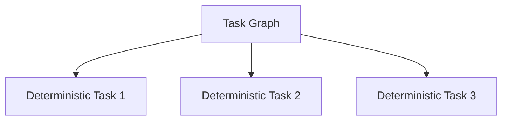
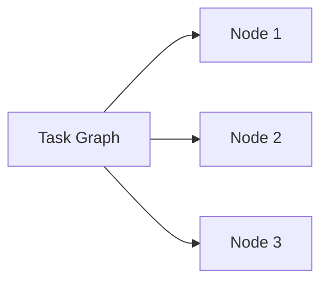

# Performance Model

KORA introduces structural overhead to reduce model-bound computation.

This document models the performance characteristics of structured execution. The goal is not to assume improvement, but to quantify conditions under which improvement occurs.

---

## 1. Latency Decomposition

In inference-reflexive systems:

T_reflex = T_model

In KORA:

T_kora = T_construct + T_dag + T_det + T_model_partial + T_validation + T_aggregation

Each term is measurable.

Where:

| Component | Description |
|------------|-------------|
| T_construct | Task construction time |
| T_dag | Graph validation time |
| T_det | Deterministic execution time |
| T_model_partial | Model invocation time for non-deterministic tasks |
| T_validation | Schema validation time |
| T_aggregation | Final aggregation time |

---

## 2. Deterministic Reduction Effect

Let:

P = proportion of deterministic work  
T_model = full model execution time  

Then:

T_model_partial = (1 - P) * T_model

Latency becomes:

T_kora = T_overhead + (1 - P) * T_model

Where:

T_overhead = T_construct + T_dag + T_det + T_validation + T_aggregation

KORA reduces latency when:

P * T_model > T_overhead

This parallels the break-even cost model.

---

## 3. Parallel Execution Potential

Task graphs enable parallelism.

Let:

N = number of independent deterministic tasks  
T_det_i = execution time per deterministic task  

If tasks are parallelizable:

T_det_total = max(T_det_i)

Instead of:

T_det_total = sum(T_det_i)

Parallelism reduces deterministic latency impact.

---

## 4. Amdahl's Law Application

Let:

f = fraction of execution time spent in model reasoning  
1 - f = deterministic and structural fraction  

Speedup S from eliminating model calls proportionally:

S = 1 / ((1 - f) + (f / k))

Where:

k = reduction factor from decomposition

If deterministic portion increases, effective f decreases.

This shifts system bottleneck away from model.

---

## 5. Throughput Model

Throughput is limited by slowest stage.

In reflexive systems:

Throughput_reflex ≈ 1 / T_model

In KORA:

Throughput_kora ≈ 1 / max(T_det_parallel, T_model_partial)

If deterministic tasks dominate and parallelize:

Throughput improves.

If model remains dominant:

Throughput remains bounded by model.

---

## 6. Latency Variance Reduction

Model inference latency is often variable.

Deterministic execution latency is stable.

Let:

Var_model = variance of model latency  
Var_det = variance of deterministic execution  

Total variance:

Var_kora ≈ (1 - P)^2 * Var_model + Var_det

As P increases:

Model-driven variance decreases quadratically.

Latency becomes more predictable.

---

## 7. Distributed Scaling

In distributed execution:

Let:

M = number of execution nodes  

Deterministic tasks can scale with M.

Model-bound tasks remain limited by model throughput.  Overall scalability improves when deterministic coverage increases.

 Parallel deterministic scaling shifts system bottleneck.

---

## 8. Structural Overhead Bound

Structural overhead must remain sublinear relative to model cost.

Constraint:

T_overhead << P * T_model

If overhead grows with task fragmentation excessively, performance gains collapse.
 Decomposition granularity must be optimized.

---

## 9. Failure Impact on Performance

Monolithic failures restart entire inference.
 Atomic failures retry only isolated tasks.

Expected retry cost:

E_retry_kora = retry_rate * T_model_partial

Which is smaller than retry_rate * T_model in reflexive systems.
 Isolation reduces performance degradation under instability.

---

## 10. Performance Guarantees

KORA does not guarantee universal speedup.

It guarantees:

- Deterministic tasks never invoke model.
- Model latency scales with necessity.
- Structural overhead is bounded.
- Parallelism is structurally enabled.

Speedup depends on workload characteristics.

---

## 11. Conditions for Superiority

KORA outperforms reflexive systems when:

- Deterministic proportion P is non-trivial.
- Structural overhead remains bounded.
- Deterministic tasks are parallelizable.
- Model latency variance is significant.

If these conditions fail, gains diminish.

Performance is conditional.

---

## Closing Position

KORA does not assume performance improvement. It formalizes performance tradeoffs. When structure meaningfully reduces model-bound work, both cost and latency benefit.

When structure is ceremonial, overhead dominates.

**Performance follows structure.**
