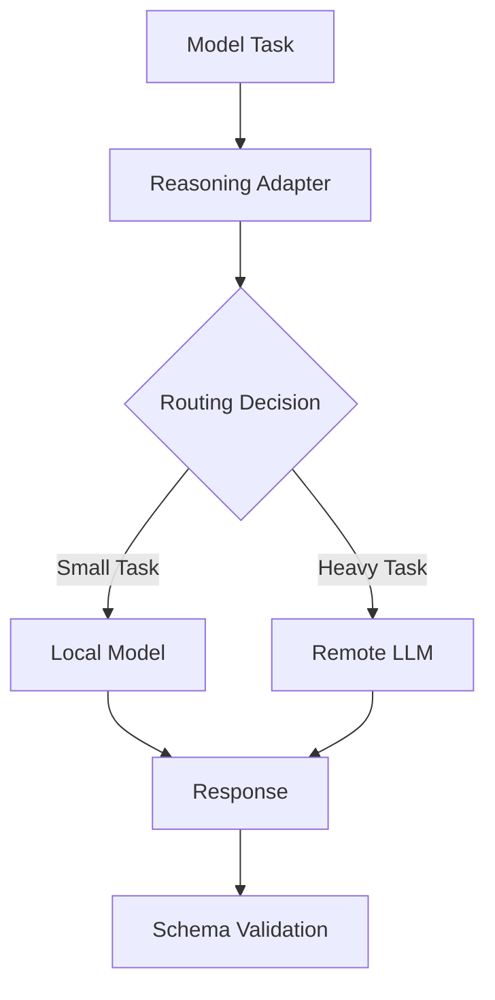
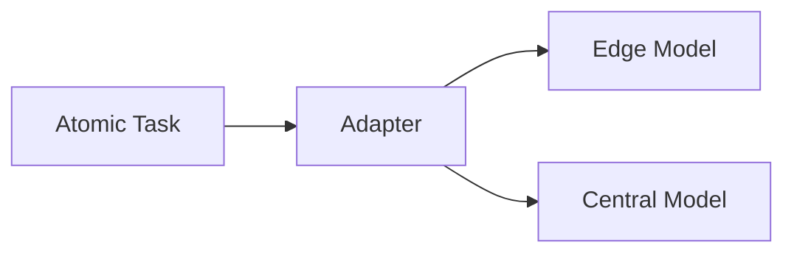

# Reasoning Adapter

KORA does not embed reasoning inside itself.

It delegates reasoning through an abstraction layer called the **Reasoning Adapter**.
 This separation preserves model neutrality and enables compute flexibility.

---

## 1. Architectural Purpose

The reasoning adapter exists to separate:

- Task orchestration
- Model invocation
- Vendor-specific APIs

Without this separation, KORA would collapse into a wrapper.
 
With it, KORA remains an execution architecture.

---

## 2. Adapter Interface

Every model invocation passes through a standardized interface.

| Field            | Description |
|------------------|-------------|
| input_payload    | Structured prompt or reasoning request |
| budget           | max_tokens, max_time_ms, max_retries |
| schema           | Expected output structure |
| routing_metadata | Optional execution hints |
| telemetry        | Invocation tracking |

The adapter ensures consistent invocation semantics regardless of backend.

---

## 3. Execution Flow

 
The adapter is not a passive pass-through.

It enforces:

- Budget constraints
- Schema expectations
- Telemetry capture
- Retry policy integration

---

## 4. Model Neutrality

The adapter allows KORA to remain:

- Vendor-independent
- Model-version independent
- Infrastructure-independent

Supported backends may include:

- Remote LLM APIs
- Local lightweight models
- On-device inference engines
- Future decomposition-native models

The architecture does not assume model supremacy.

It assumes interchangeable reasoning engines.

---

## 5. Small Model Integration

Decomposition enables selective use of smaller models.

Lightweight tasks may route to:

- Distilled local models
- Task-specific micro-models
- Edge-deployed inference engines

This reduces dependency on large remote models.

Routing policy is decoupled from orchestration logic.

---

## 6. Escalation Logic

If a task fails under a lightweight model:

- Adapter may escalate to larger model
- Or split the task further
- Or fail within budget constraints

Escalation remains governed.

The adapter does not override budget discipline.

---

## 7. Retry Integration

Retries are adapter-mediated.

Retry policy may include:

- Prompt refinement
- Schema-guided correction
- Alternate model selection

Retries remain bounded by:

- max_retries
- max_time_ms
- Global policy constraints

The adapter integrates retry logic without collapsing structure.

---

## 8. Observability

Each invocation records:

- Model used
- Tokens consumed
- Latency
- Retry count
- Escalation path

Telemetry is unified across model types.

This allows cross-model comparison and cost analysis.

---

## 9. Adapter and Decentralization

Because tasks are atomic and adapter-mediated:

- Routing may vary per task
- Local compute may execute partial reasoning
- Remote models may only handle irreducible components  

 
Routing flexibility emerges from adapter abstraction.

---

## 10. Future Direction - Decomposition-Native Models

Current foundation models are prompt-native.

Future models may accept:

- Structured task graphs
- Explicit dependency trees
- Budget-aware execution instructions

The adapter layer allows KORA to integrate such models without architectural redesign.

The adapter future-proofs the system.

---

## 11. Structural Guarantees

The reasoning adapter ensures:

- **Model neutrality**
- **Budget enforcement at invocation boundary**
- **Schema validation integration**
- **Routing flexibility**
- **Retry governance**

Without adapter abstraction, decomposition would remain local.
 With it, routing becomes global.

---

## Closing Position

KORA does not attempt to replace models.
 It surrounds them with structure.

The reasoning adapter ensures that:

- Invocation is governed
- Routing is flexible
- Models remain interchangeable

**Models reason.  
Architecture decides when and how.**
