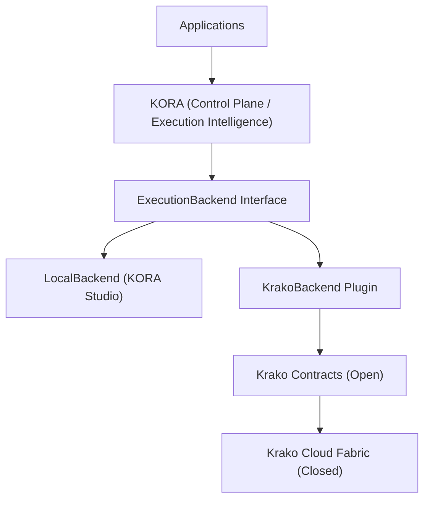
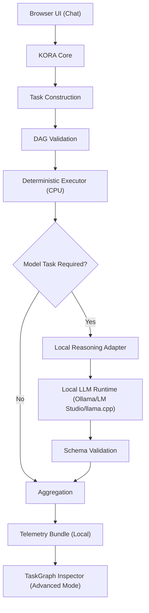
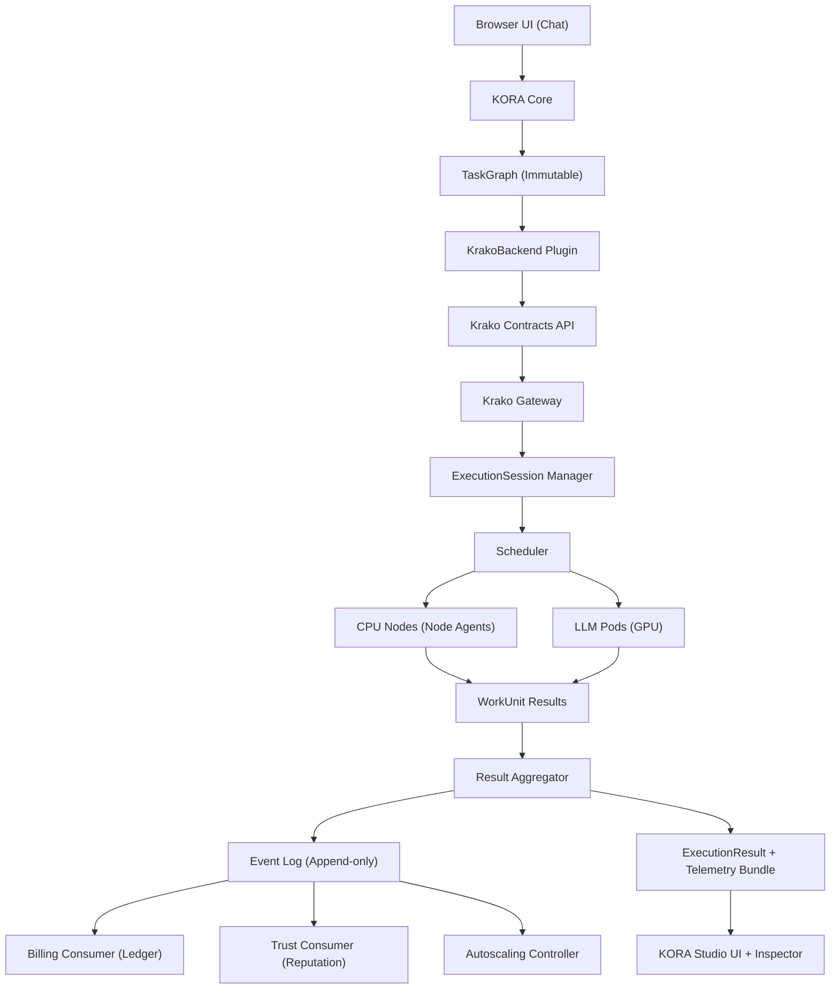
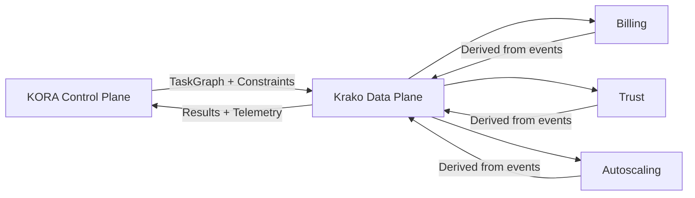
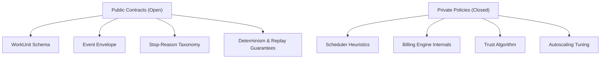
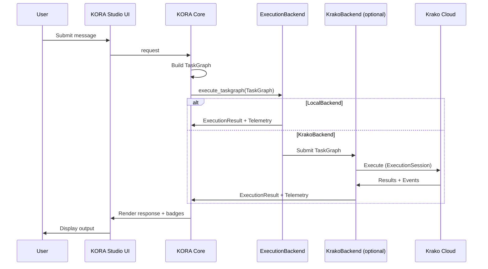

# KORA + KORA Studio + Krako Cloud – Integrated System Architecture Diagram v1.0

Status: Architecture Integration Draft  
Language: English (Official Document)  
Purpose: Provide a single, unambiguous architecture diagram set that explains how KORA, KORA Studio, Krako Contracts, and Krako Cloud work together without dependency confusion.

---

# 1. Canonical Dependency Direction

Dependency must flow in one direction:

KORA (semantic authority)
    ↓
Krako Contracts (public interface)
    ↓
Krako Cloud Fabric (private infrastructure)

KORA Studio runs KORA locally and may optionally use Krako Cloud via a backend plugin.

---

# 2. System Stack Diagram

---

# 3. KORA Studio (Local-Only) Architecture

---

# 4. Optional Cloud Execution Path (Studio → Krako Cloud)

---

# 5. Control vs Data Plane Boundary

Rules:

• KORA owns semantics (what/why).  
• Krako owns execution (where/how).  
• Billing/Trust/Autoscaling consume events asynchronously.  

---

# 6. Contract vs Policy Boundary

Public contracts must remain stable and versioned.
Private policies may evolve without breaking contracts.

---

# 7. End-to-End Execution Sequence (High Level)

---

# 8. Summary

This architecture ensures:

• KORA Studio runs fully standalone  
• Krako Cloud is optional and plugin-based  
• Contracts are public, policies are private  
• Semantic authority remains in KORA  
• Scale and monetization remain in Krako Cloud

---

End of Document

