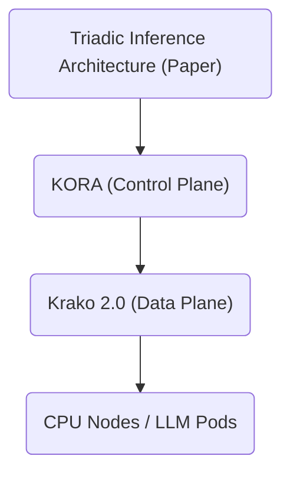

# Krako–KORA Boundary Definition v1.0 (Draft)

Version: v1.0-draft  
Status: Internal Boundary Contract (Draft)  
Owner: Krako Core Team  
Last Updated: 2026-02-26  

---

# 0. Purpose

This document defines the formal boundary between:

- **KORA** (Control Plane execution intelligence)
- **Krako 2.0** (Data Plane distributed execution fabric)

The goal is to prevent duplicate implementation, architectural drift, and responsibility collapse.

This document specifies:

- Layer separation and responsibility matrix
- Canonical entities and mapping rules
- Event/telemetry contract surfaces
- Budget and determinism invariants
- Forbidden responsibility transfers
- Required CI gate checks

---

# 1. System Layer Separation

## 1.1 Layered Model

## 1.2 Definitions

- **Triadic Architecture**: inference strategy and routing thesis (SM/SMem/LLM) expressed as research positioning.
- **KORA**: deterministic orchestration engine that converts requests into a TaskGraph and defines escalation/routing logic.
- **Krako 2.0**: distributed execution fabric that schedules and executes WorkUnits, enforces constraints, and produces replayable telemetry for billing/trust.

---

# 2. Responsibility Matrix (Hard Boundary)

## 2.1 KORA Responsibilities (Control Plane)

**• KORA MUST**

- Produce **TaskGraph** (DAG) from request
- Decompose into **WorkUnits** (typed, bounded)
- Define **escalation logic** as explicit graph structure
- Declare **budgets** and **constraints** (privacy, latency, max LLM invocations)
- Declare **idempotency** and **criticality** per WorkUnit
- Define **verification_mode** intent (schema/quorum/recompute)

**• KORA MUST NOT**

- Perform distributed scheduling
- Select specific node/pod targets
- Implement retry/backoff policy
- Implement congestion control
- Implement billing calculations
- Implement trust scoring
- Mutate Krako runtime state (credits, trust, capacity)

Reference: KORA runtime boundary principles (IR / Executor / Governance / Adapter separation).

---

## 2.2 Krako 2.0 Responsibilities (Data Plane)

**• Krako MUST**

- Validate TaskGraph invariants (acyclic, budgets sane)
- Create and manage **ExecutionSession** lifecycle
- Schedule and dispatch WorkUnits across substrates
- Enforce hard constraints:
  - llm → LLM Pod only
  - local_only → trusted CPU only
- Implement retry/backoff/circuit breaker/admission enforcement
- Emit canonical telemetry/events (at-least-once)
- Run replay-safe billing and trust consumers (async)
- Maintain claim/ownership safety for execution under contention

**• Krako MUST NOT**

- Rewrite WorkUnit type
- Invent new escalation steps not present in TaskGraph
- Modify KORA’s routing logic
- Escalate to heavier model outside TaskGraph specification
- Alter budget upward (budget non-increase invariant)

---

# 3. Canonical Entities

## 3.1 KORA Entities

- **TaskGraph**: immutable DAG produced by KORA
- **WorkUnit**: atomic execution unit declared in TaskGraph

## 3.2 Krako Entities

- **ExecutionSession**: runtime instance created per TaskGraph submission
- **WorkUnitExecution**: stateful execution record for each WorkUnit
- **NodeRegistry / Pod Pools**: execution substrates
- **Event Log**: append-only event backbone
- **Ledger**: append-only billing ledger
- **Trust State**: append-derived node trust state

---

# 4. Mapping Contracts

## 4.1 TaskGraph → ExecutionSession

**•** One accepted TaskGraph MUST create exactly one ExecutionSession.

Mapping:

- TaskGraph.graph_id → ExecutionSession.graph_id
- TaskGraph.request_id → ExecutionSession.request_id
- TaskGraph.tenant_id → ExecutionSession.tenant_id
- TaskGraph.created_at → ExecutionSession.created_at

## 4.2 WorkUnit → WorkUnitExecution

**•** Each WorkUnit declared in TaskGraph MUST create a WorkUnitExecution record.

Required mapping:

- WorkUnit.id → WorkUnitExecution.work_unit_id
- WorkUnit.type → substrate constraints (cpu vs llm_pod)
- WorkUnit.dependencies → readiness gating
- WorkUnit.constraints/privacy → placement enforcement
- WorkUnit.retries.max_attempts/backoff_ms → retry engine parameters

---

# 5. Interface Surfaces

## 5.1 Ingress Surface

- Krako accepts TaskGraph JSON payload from KORA
- Krako validates:
  - schema_version compatibility
  - DAG acyclicity
  - dependency resolution
  - budgets non-negative
  - WorkUnit IDs unique

Failure → reject before execution.

## 5.2 Telemetry Surface (Execution → Consumers)

Krako emits append-only events:

- workunit.scheduled / claimed / completed / failed
- llm.invocation.completed / failed
- capacity.scale.requested / capacity.admission.mode.changed
- node.health.updated

Billing and Trust consume these asynchronously.

---

# 6. Invariants (Must Hold Globally)

## 6.1 Determinism Invariants

- Same TaskGraph + same runtime state inputs → deterministic scheduling decision for ties
- Claim mechanism prevents duplicate execution under contention
- Replay of identical event stream produces identical ledger and wallet snapshots

## 6.2 Budget Invariants

- Budget is contractual and MUST NOT increase during execution
- Krako may reject early if impossible to satisfy
- Retries and escalation must remain within declared limits

## 6.3 Escalation Invariants

- Escalation path is defined only by KORA in TaskGraph
- Krako MUST NOT invent escalation steps

## 6.4 Billing Invariants

- No double billing on retry
- Dedupe by event_id
- Split line-items:
  - workunit_cpu (from workunit.completed cpu)
  - llm_tokens (from llm.invocation.completed)

---

# 7. Forbidden Responsibility Transfers

Krako MUST NOT:

- Modify WorkUnit type
- Modify escalation logic
- Generate new WorkUnits not declared
- Perform KORA decomposition

KORA MUST NOT:

- Decide placement target node/pod
- Maintain runtime capacity state
- Implement retry/backoff or admission enforcement
- Debit credits / maintain ledger

---

# 8. Required CI Gate Checks

Minimum CI gates for integration safety:

- TaskGraph validation suite (acyclic, deps, version)
- WorkUnit type → substrate enforcement tests
- Privacy constraint enforcement tests
- Claim contention tests (multi-agent)
- Billing replay determinism tests
- LLM token billing split (no double charge) tests
- Telemetry completeness tests

---

# 9. Versioning Policy

- TaskGraph schema_version is controlled by KORA
- Krako must explicitly support compatible schema versions
- Breaking changes require a new major schema_version and compatibility mapping

---

# 10. Next Deliverables

- Krako–KORA Interface Spec v1.0 (field-level mapping tables)
- Event taxonomy alignment guide (KORA stage semantics ↔ Krako event types)
- Compatibility test harness (KORA real_workload_harness executed via Krako runtime)

