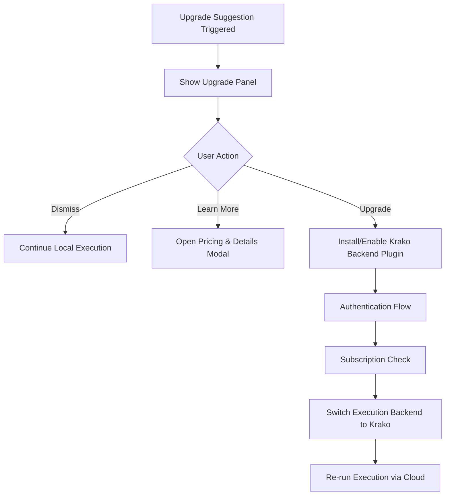

# KORA Studio – Krako Cloud Upgrade UX Specification v1.0

Status: Product UX & Monetization Draft  
Language: English (Official Document)  
Purpose: Define the user experience, decision logic, safeguards, and transparency rules governing upgrade from KORA Studio (local-only) to Krako Cloud (distributed infrastructure).

---

# 1. Design Principles

Upgrade to Krako Cloud must be:

• Explicit, never automatic  
• Transparent in cost  
• Justified by resource limits  
• Reversible at any time  
• Architecturally clean (no hidden coupling)

KORA Studio must always remain fully functional without Krako.

---

# 2. Upgrade Triggers

Upgrade suggestions are triggered only under specific measurable conditions.

## 2.1 Resource Ceiling Detection

Triggers include:

• Model VRAM exceeds local GPU capacity  
• Context window too large for local model  
• Concurrent session demand exceeds CPU/GPU limits  
• Execution time exceeds local latency threshold  
• User manually selects "High Performance Mode"

These triggers must only produce suggestions, never forced routing.

---

# 3. Upgrade Suggestion Panel

When a trigger condition occurs, a non-blocking suggestion panel appears.

## 3.1 Panel Contents

The panel must include:

• Clear explanation of limitation (e.g., "This model requires 24GB VRAM.")  
• Estimated local capability  
• Estimated Krako Cloud performance improvement  
• Estimated cost per execution  
• Comparison table: Local vs Cloud

Example comparison table:

| Dimension | Local | Krako Cloud |
|------------|--------|--------------|
| Max Model Size | 13B | 70B+ |
| Concurrency | 1–2 sessions | 100+ sessions |
| Avg Latency | 3.2s | 1.1s |
| Cost | Free (local compute) | Usage-based |

---

# 4. User Decision Flow

Rules:

• Dismiss must not reappear for same task within same session.  
• Upgrade must require explicit confirmation.

---

# 5. Authentication & Subscription UX

## 5.1 Authentication

Supported methods:

• Email login  
• OAuth providers  
• API key entry

Authentication must be:

• Explicit  
• Secure  
• Reversible (logout supported)

---

## 5.2 Subscription Status Display

Sidebar must show:

• Subscription tier  
• Remaining credits  
• Current billing period  
• Link to billing portal

If credits are insufficient:

• Execution must fail gracefully  
• Clear "Insufficient Credits" message  
• Option to purchase more

---

# 6. Cost Transparency Rules

Every cloud execution must display:

• Tokens consumed  
• Estimated cost  
• Final billed amount  
• Backend used (region + model tier)

No hidden billing.

A "Cost Breakdown" button must reveal:

• LLM token cost  
• CPU execution cost  
• Network cost (if applicable)

---

# 7. Execution Backend Switching

Execution backend must be switchable at runtime.

Options:

• Local Only  
• Prefer Local, Fallback to Cloud  
• Cloud Only

Rules:

• Default: Local Only  
• Fallback requires explicit opt-in  
• No automatic fallback without user approval

---

# 8. Fallback Behavior

If Cloud backend fails:

• Show clear error  
• Offer retry  
• Offer switch back to local  

No silent backend switching.

---

# 9. Telemetry Integration

Cloud executions must integrate into existing TaskGraph Inspector.

Additional fields shown for cloud tasks:

• node_id (cloud execution node)  
• region  
• execution_session_id  
• billing_id

Inspector must visually distinguish local vs cloud tasks.

---

# 10. Privacy & Data Disclosure UX

Before first cloud execution, show:

• Data transfer notice  
• Statement of encryption in transit  
• Statement of non-retention policy (if applicable)

User must explicitly accept before first cloud execution.

---

# 11. Upgrade Reversibility

User must be able to:

• Disable cloud backend at any time  
• Clear authentication tokens  
• Continue operating locally without limitation

No feature lock-in.

---

# 12. Visual Identity in Upgrade Mode

UI must indicate cloud execution clearly:

• Cloud badge on message  
• Backend label in execution badge  
• Cost displayed inline

Avoid:

• Dark patterns  
• Automatic escalation  
• Ambiguous backend switching

---

# 13. Strategic Outcome

KORA Studio proves structural efficiency locally.
Krako Cloud provides scalable infrastructure when needed.

The upgrade UX must:

• Encourage adoption  
• Preserve user trust  
• Maintain architectural separation  
• Monetize scale, not structure

---

# Final Position

Upgrade must be:

• Justified  
• Transparent  
• Optional  
• Reversible

Structure remains local.
Scale is purchased.

---

End of Document

