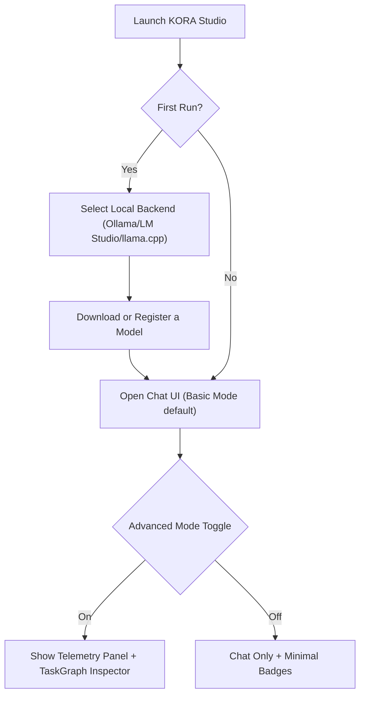
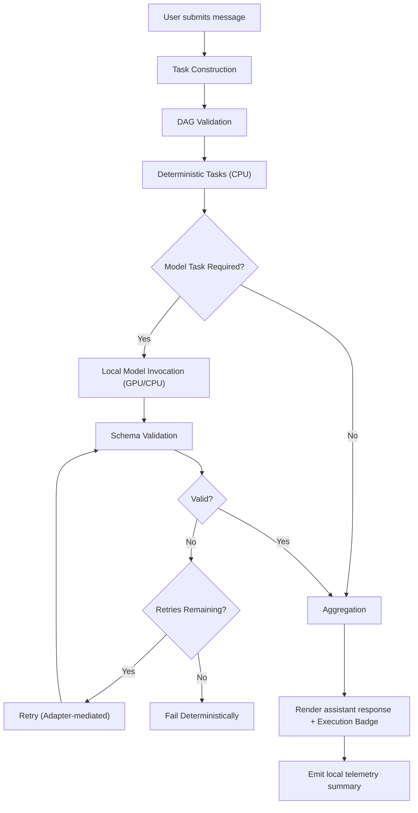
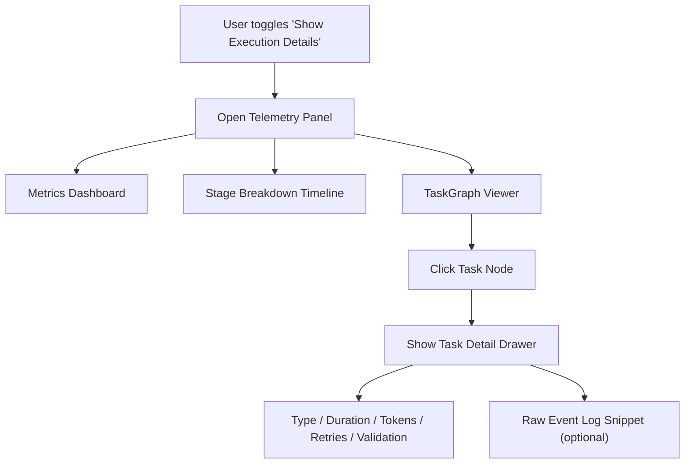
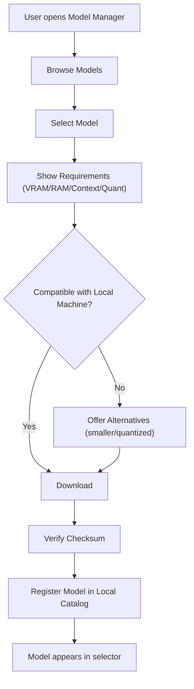
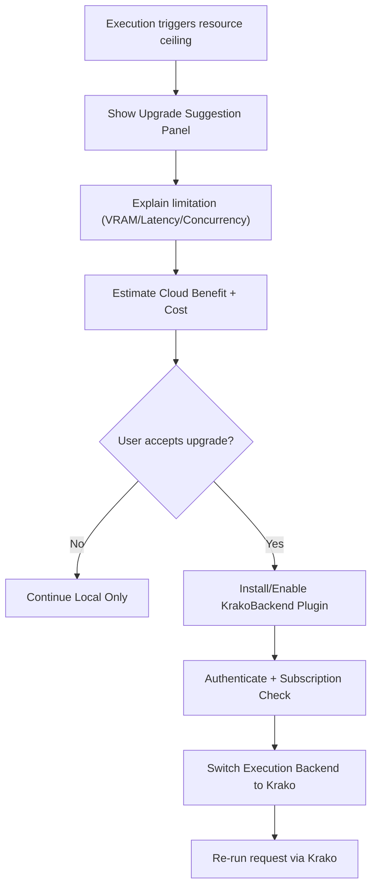
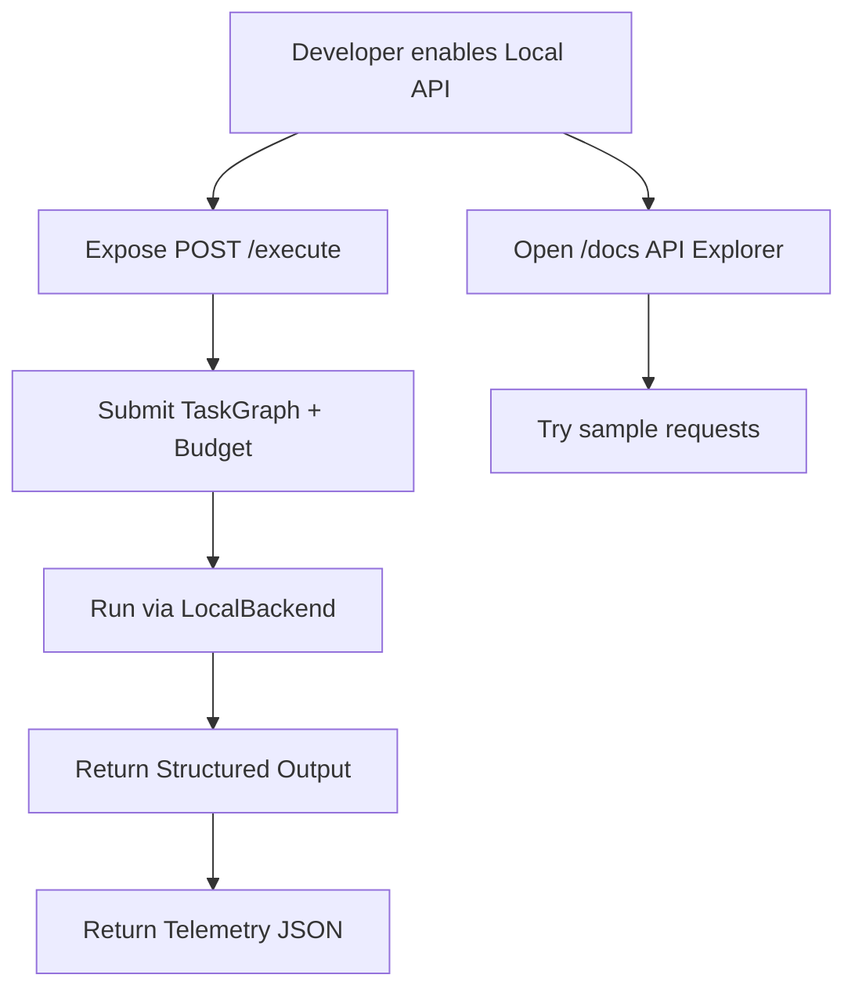

# KORA Studio UX Wireframe & Interaction Specification v1.0

Status: Product UX Draft  
Language: English (Official Document)  
Purpose: Define the user interface structure, interaction model, and visual hierarchy for KORA Studio.

---

# 1. UX Design Philosophy

KORA Studio is not just a chat interface.
It is an execution intelligence runtime.

The UX must:

• Preserve simplicity for casual users  
• Expose structure for advanced users  
• Make deterministic-first behavior visible  
• Make model invocation measurable  
• Never hide inference events  

Two operating modes are supported:

• Basic Mode  
• Advanced Mode

---

# 2. Global Layout Structure

## 2.1 Primary Layout

--------------------------------------------------
| Sidebar | Chat Window | Telemetry Panel (Optional) |
--------------------------------------------------

### Sections

1. Left Sidebar  
2. Center Chat Interface  
3. Right Telemetry / Inspector Panel (toggleable)

---

# 2.2 Screen Flow Diagrams (Mermaid)

The following Mermaid diagrams define the canonical navigation and execution flows.

IMPORTANT: Parentheses () inside Mermaid node labels must be wrapped in double quotes to avoid parse errors.

## 2.2.1 App Launch & Mode Selection

## 2.2.2 Chat Request Execution Flow (Local Backend)

## 2.2.3 Telemetry Panel Interaction Flow

## 2.2.4 Model Download & Registration Flow

## 2.2.5 Upgrade Suggestion Flow (Optional Krako Cloud)

## 2.2.6 Developer API Flow (Local)

---

## 2.1 Primary Layout

--------------------------------------------------
| Sidebar | Chat Window | Telemetry Panel (Optional) |
--------------------------------------------------

### Sections

1. Left Sidebar  
2. Center Chat Interface  
3. Right Telemetry / Inspector Panel (toggleable)

---

# 3. Left Sidebar

## 3.1 Model Manager Section

Displays:

• Installed local models  
• Model size (7B, 13B, etc.)  
• Quantization type  
• VRAM requirement  
• Backend type (Ollama, LM Studio, llama.cpp)

User can:

• Select active model  
• Download new model  
• Remove model  
• View model metadata

---

## 3.2 Execution Settings

User-adjustable settings:

• max_tokens  
• max_time_ms  
• max_retries  
• Temperature  
• Top-p  

Advanced Settings (collapsed by default):

• Deterministic-only mode  
• Disable schema enforcement (dev mode only)  
• Enable verbose telemetry  

---

## 3.3 Backend Selection

Execution Backend:

• Local (default)  
• Krako Cloud (if plugin installed)

Cloud option must display:

• Subscription status  
• Estimated remote cost  
• Upgrade link

---

# 4. Center Chat Interface

## 4.1 Default Behavior (Basic Mode)

User sees:

• Chat input field  
• Conversation history  
• Send button  
• Stop generation button  

User experience resembles ChatGPT.

Differences:

• A small execution badge appears after each message:
  - Deterministic Only  
  - Model Invoked  
  - Hybrid Execution

---

## 4.2 Message Metadata Indicator

Each assistant message includes:

• Execution path label  
• Token usage summary  
• Duration

Example:

"Execution: Deterministic + Model (1 call) | 320 tokens | 1.2s"

---

# 5. Telemetry Panel (Advanced Mode)

Toggle button: "Show Execution Details"

Panel displays:

## 5.1 Task Graph Viewer

• DAG visualization  
• Deterministic tasks  
• Model tasks  
• Aggregation tasks

Each node displays:

• Task ID  
• Task type  
• Execution time  
• Retry count  
• Validation status

---

## 5.2 Metrics Dashboard

Displays:

• Deterministic tasks count  
• Model invocations count  
• Tokens in  
• Tokens out  
• Retry attempts  
• Validation failures  
• Total latency breakdown

---

## 5.3 Stage Breakdown

Shows stage timing:

• Task construction  
• DAG validation  
• Deterministic execution  
• Model invocation  
• Schema validation  
• Aggregation

Graphical timeline bar recommended.

---

# 6. Basic vs Advanced Mode

## 6.1 Basic Mode

• Chat only  
• Minimal execution badges  
• No graph inspector  
• No stage breakdown

Target user:

• General users  
• Non-technical users

---

## 6.2 Advanced Mode

• Full DAG visualization  
• Telemetry metrics  
• Task-level breakdown  
• Retry visibility  
• Schema validation logs

Target user:

• Developers  
• Researchers  
• Power users

---

# 7. Error and Budget UX

## 7.1 Budget Breach UI

If budget exceeded:

Display:

• Clear error banner  
• "Budget limit reached" message  
• Suggest increasing max_tokens or upgrading backend

---

## 7.2 Validation Failure UI

Display:

• "Output schema invalid"  
• Retry attempt count  
• Structured error details (expandable)

No silent retry loops.

---

# 8. Upgrade Experience (Krako Cloud)

When local limits are detected:

Trigger suggestion panel:

"This task exceeds local capability. Upgrade to Krako Cloud for distributed execution."

Display:

• Estimated performance improvement  
• Estimated cost  
• One-click backend switch

No automatic forced upgrade.

---

# 9. Developer API UX

## 9.1 API Explorer Page

Accessible at:

/localhost:port/docs

Displays:

• TaskGraph schema  
• Example requests  
• Live execution test panel  
• Telemetry JSON output

---

# 10. Design Principles for UI

UI must:

• Make structure visible but not overwhelming  
• Avoid hype visuals  
• Emphasize execution transparency  
• Preserve minimalism  
• Avoid unnecessary animations  
• Keep advanced features collapsible

---

# 11. Visual Identity

Tone:

• Technical  
• Clean  
• Structured  
• Professional

Avoid:

• Gamification  
• Cartoonish elements  
• AI hype aesthetics

KORA Studio is an execution OS, not a chatbot toy.

---

# 12. Summary

KORA Studio UX must:

• Feel familiar (chat interface)  
• Reveal structure (advanced mode)  
• Demonstrate deterministic-first behavior  
• Make inference measurable  
• Encourage upgrade only when necessary

Structure must remain visible.
Simplicity must remain accessible.

Execution transparency is the differentiator.

