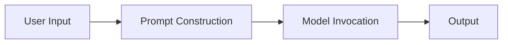
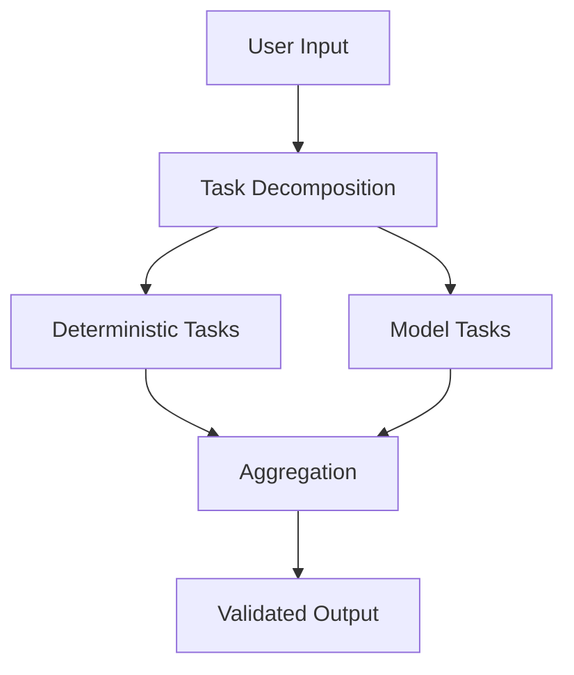

# Structural Critique

KORA does not begin by criticizing models.

It begins by examining how they are invoked.

The dominant pattern in modern AI systems is not wrong because models are weak. It is structurally limited because invocation is reflexive.

---

## 1. The Inference-Reflexive Pattern

Most LLM-based systems follow a simple execution path:

Every request results in a model call.

This pattern is consistent across:

- Chat interfaces
- Agent frameworks
- API wrappers
- Workflow systems

The architecture assumes that reasoning is required for every input.

This assumption is rarely questioned.

---

## 2. Collapsing Two Decisions Into One

There are two logically distinct questions in any intelligent system:

1. Does this request require reasoning?
2. If so, what is the correct reasoning?

Inference-reflexive systems answer both questions by invoking a model.

This collapses necessity and reasoning into a single probabilistic step.

The result:

- Trivial tasks consume inference resources.
- Deterministic problems are solved stochastically.
- Cost scales with input volume rather than reasoning necessity.

The model is capable.

The architecture is undiscerning.

---

## 3. Prompt as Monolithic Unit

Prompt-centric systems treat the prompt as the smallest execution unit.

But prompts are not structured objects.

They bundle:

- Transformations
- Deterministic operations
- Context assembly
- Genuine reasoning

When these layers are hidden inside a single text string, the system loses control.

Hidden structure cannot be governed.

---

## 4. The Illusion of Intelligence Scaling

Scaling in inference-reflexive systems often means:

- Larger prompts
- More tokens
- Larger models

But this scaling hides structural inefficiency.

More tokens do not mean more intelligence.

They may simply mean more bundled operations.

Without structural separation, scaling amplifies:

- Cost
- Latency
- Centralization
- Opacity

The illusion is capability.
The reality is bundling.

---

## 5. The Cost Reflex

When invocation is reflexive:

Total cost is proportional to total requests.

Let:

- T be total requests
- C be cost per model call

Total cost:

C * T

There is no structural filtering.

No discrimination between trivial and reasoning-heavy inputs.

The architecture is indifferent to necessity.

---

## 6. Centralization as Emergent Property

Because model calls are large and monolithic:

- They require high-capacity hardware.
- They cluster around GPU data centers.
- They discourage heterogeneous routing.

Centralization is not ideological.
It is architectural.

Monolithic inference produces centralized infrastructure.

---

## 7. Observability Deficit

Inference-reflexive systems often treat the model call as atomic.

Telemetry may record:

- Token usage
- Response time

But not:

- Internal decomposition
- Deterministic pruning
- Selective routing

The system sees a single reasoning block.

It cannot observe structural composition.

---

## 8. Why This Is Structural, Not Model-Level

The critique is not that models are flawed.

Large language models are powerful probabilistic engines.

The limitation arises when:

- Invocation is automatic
- Structure is implicit
- Budgets are advisory
- Validation is optional

The issue is architectural discipline.

---

## 9. Structural Alternative

KORA proposes a structural alternative:

Two changes occur:

1. Necessity is evaluated before reasoning.
2. Structure is explicit before scaling.

The model remains powerful.
The architecture becomes disciplined.

---

## 10. Consequences of Structural Shift

When reflexivity is removed:

- Deterministic tasks bypass inference.
- Model invocation becomes selective.
- Cost scales with reasoning, not volume.
- Routing becomes possible.
- Decentralized compute becomes feasible.

The difference is not incremental.

It is architectural.

---

## Closing Position

Inference-reflexive systems are convenient.

Structured systems are disciplined.

Convenience scales cost.
Structure scales control.

KORA does not replace models.

It replaces reflex with architecture.

**Structure precedes reasoning.  
Reasoning follows necessity.**
