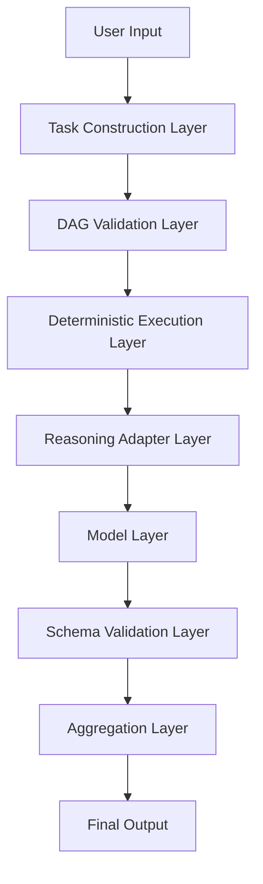
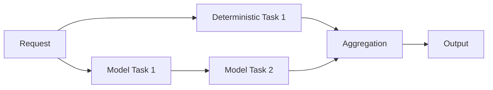
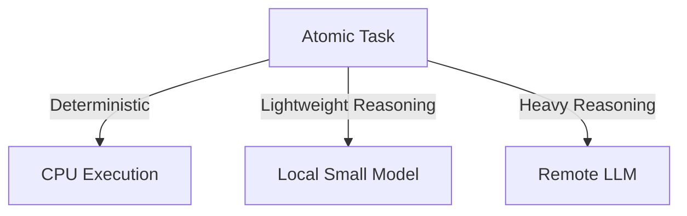
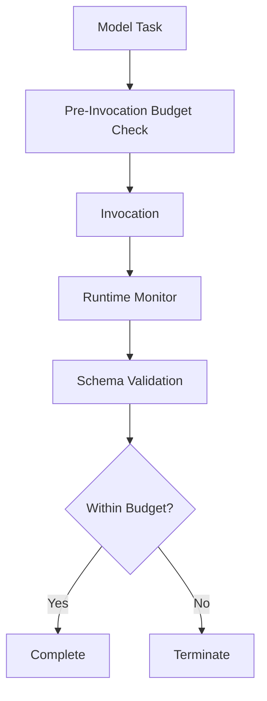
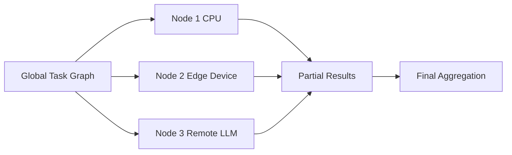
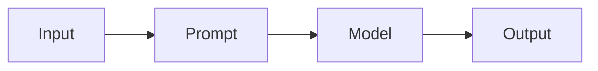
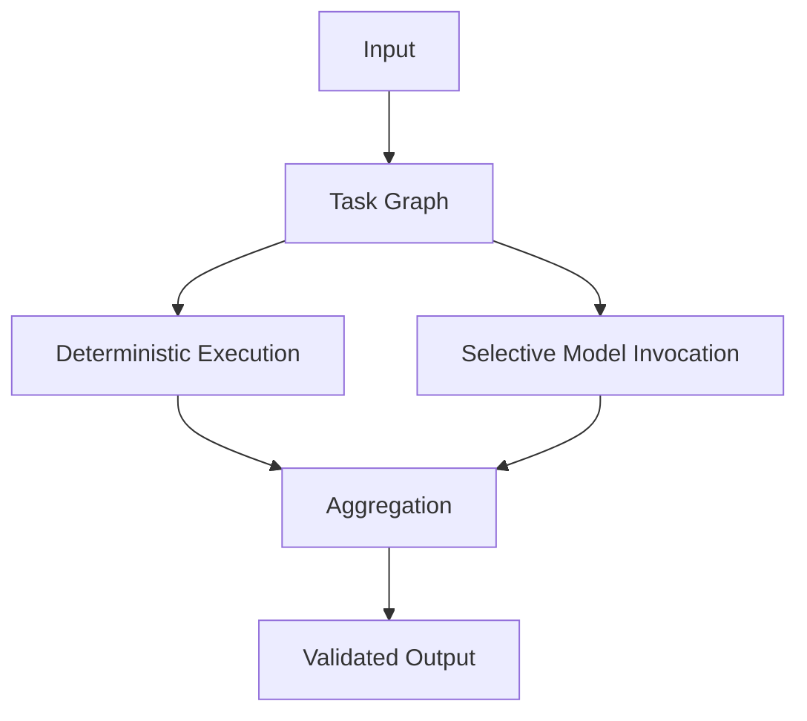

# System Diagram

This document visualizes KORA as a layered execution system.

The diagrams are not decorative.  
They clarify structural boundaries.

---

## 1. Layered Architecture

Each layer has a single responsibility.

**No layer bypasses another.**

---

## 2. Task Graph Structure

This graph shows:

- Deterministic tasks execute locally.
- Model tasks execute selectively.
- Aggregation recombines outputs.
- Failures remain isolated.

---

## 3. Routing Architecture

Routing decisions are policy-driven.

Tasks are movable because they are atomic.

**Decomposition enables routing.**

---

## 4. Budget Enforcement Lifecycle

Inference cannot escape governance.

Budget enforcement exists at multiple checkpoints.

---

## 5. Distributed Execution Fabric

This illustrates long-term direction:

- Tasks may execute across nodes.
- Atomic structure enables distribution.
- Aggregation preserves coherence.

---

## 6. Structural Comparison

### Inference-Reflexive Model

### Structured KORA Model

The difference is not capability.

The difference is structural governance.

---

## 7. Execution Guarantees Summary

| Property | Description |
|----------|-------------|
| Deterministic-first | Trivial tasks never invoke model |
| Budget-bound | No unbounded inference |
| Schema-validated | Output must match contract |
| Atomic tasks | Failures are localized |
| Routing-capable | Tasks may execute on heterogeneous compute |

These guarantees emerge from structure, not configuration.

---

## Closing View

KORA is not centered on the model.

It is centered on structure.

Models are invoked when necessary.  
Tasks are routed when possible.  
Budgets are enforced always.

**Structure governs execution.**
