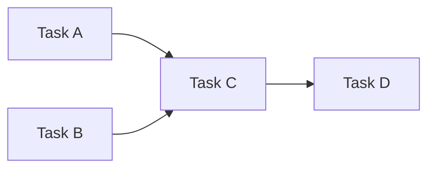
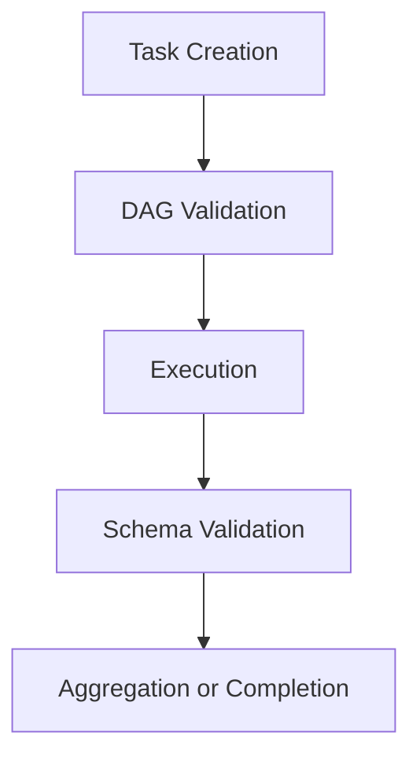

# Task IR Specification

The Task Intermediate Representation (Task IR) is the foundational data structure of KORA.

All execution flows through Task IR.

Without Task IR, decomposition collapses into prompt engineering.

This document defines the formal structure, invariants, and lifecycle of Task IR.

---

## 1. Purpose

Task IR exists to make execution:

- Explicit
- Typed
- Bounded
- Validatable
- Routable

A Task is not a prompt string.

It is a structured execution object.

---

## 2. Core Schema

The canonical Task IR representation:

```json
{
  "version": "1.0",
  "id": "task-uuid",
  "type": "deterministic | model | aggregation",
  "dependencies": ["task-id-1", "task-id-2"],
  "input": {},
  "schema": {},
  "budget": {
    "max_tokens": 512,
    "max_time_ms": 2000,
    "max_retries": 2
  },
  "routing": {
    "preferred_backend": "optional",
    "priority": "normal | high"
  },
  "metadata": {
    "created_at": "timestamp",
    "trace_id": "request-uuid"
  }
}
```

All fields are explicit.

No implicit execution context is allowed.

---

## 3. Field Definitions

| Field | Required | Description |
|--------|----------|-------------|
| version | Yes | Task IR schema version |
| id | Yes | Unique task identifier |
| type | Yes | Execution category |
| dependencies | Yes | List of upstream task ids |
| input | Yes | Structured input payload |
| schema | Yes | Expected output contract |
| budget | Required for model | Resource constraints |
| routing | Optional | Execution hints |
| metadata | Optional | Observability data |

---

## 4. Task Types

### Deterministic

Executed without model invocation.

Properties:

- No token generation
- Must terminate within bounded time
- Must be pure function

### Model

Requires probabilistic inference.

Properties:

- Must include budget
- Must include schema
- Must pass validation

### Aggregation

Combines outputs of dependent tasks.

Properties:

- Deterministic
- Must not invoke model
- Must validate upstream outputs

---

## 5. Invariants

The following are structural invariants:

1. **Every task must have explicit type.**
2. **Model tasks must declare budget.**
3. **All outputs must conform to schema.**
4. **Dependencies must form a DAG.**
5. **No hidden side effects are allowed.**

Violations result in execution rejection.

---

## 6. Dependency Model

Tasks form a Directed Acyclic Graph.



Rules:

- No cycles permitted.
- Dependency resolution required before execution.
- Aggregation tasks must depend on all contributing tasks.

DAG validation is mandatory before execution.

---

## 7. Schema Contract

Each task declares an output schema.

Example:

```json
{
  "type": "object",
  "properties": {
    "result": { "type": "string" },
    "confidence": { "type": "number" }
  },
  "required": ["result"],
  "additionalProperties": false
}
```

Schema rules:

- additionalProperties must default to false.
- Output must match declared type exactly.
- Validation occurs post-execution.
- Failure triggers retry or deterministic failure.

Schema is enforcement boundary.

---

## 8. Budget Semantics

Budget applies only to model tasks.

Fields:

| Parameter | Meaning |
|------------|----------|
| max_tokens | Maximum generated tokens |
| max_time_ms | Maximum allowed runtime |
| max_retries | Maximum retry attempts |

If budget is exceeded:

- Execution terminates.
- Retry logic applies if allowed.
- Otherwise task fails deterministically.

Budget is not optional.

---

## 9. Routing Semantics

Routing metadata does not override policy.

It provides hints:

- preferred_backend
- priority

Routing engine decides final execution target.

Routing must never violate budget or security constraints.

---

## 10. Lifecycle

Task IR lifecycle:



Each stage emits telemetry.

No stage may be skipped.

---

## 11. Failure Semantics

Failure types:

| Type | Description |
|--------|-------------|
| ValidationFailure | Schema mismatch |
| TimeoutFailure | max_time_ms exceeded |
| BudgetFailure | max_tokens exceeded |
| DependencyFailure | Upstream task failed |
| ExecutionFailure | Deterministic execution error |

Failure must be explicit.

No silent continuation.

---

## 12. Versioning Strategy

Task IR includes explicit version field.

Rules:

- Minor version increments must preserve backward compatibility.
- Major version increments may introduce structural changes.
- Execution engine must validate version compatibility.

Backward compatibility prevents architectural drift.

---

## 13. Extension Model

Future extensions may add:

- Confidence scoring
- Resource classification
- Security classification
- Distribution hints

Extensions must:

- Preserve invariants
- Not weaken budget governance
- Not introduce hidden inference

All extensions require schema version update.

---

## 14. Observability Integration

Each task must emit:

- Execution start time
- Execution end time
- Model invocation metrics
- Retry count
- Validation outcome

Telemetry must reference task id.

Observability is part of IR contract.

---

## 15. Security Constraints

Task IR must not:

- Allow dynamic code execution
- Allow external network invocation from deterministic tasks
- Allow implicit privilege escalation

Execution environment must sandbox tasks appropriately.

---

## 16. Structural Role

Task IR is the core of KORA.

Without explicit Task IR:

- Decomposition collapses.
- Budget governance weakens.
- Routing becomes heuristic.
- Validation becomes informal.

Task IR enforces structural intelligence.

---

## Closing Position

Task IR is not a serialization format.

It is a contract.

It defines how reasoning is isolated, bounded, validated, and routed.

**Structure lives here.**
