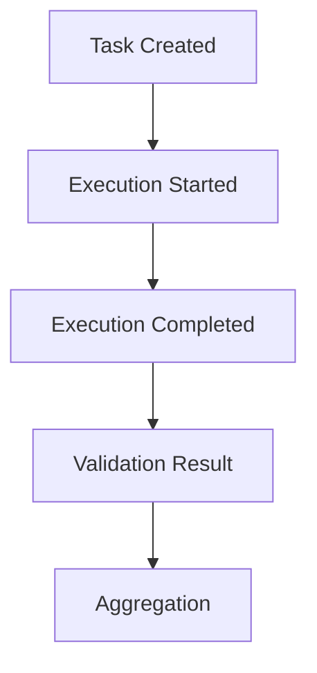
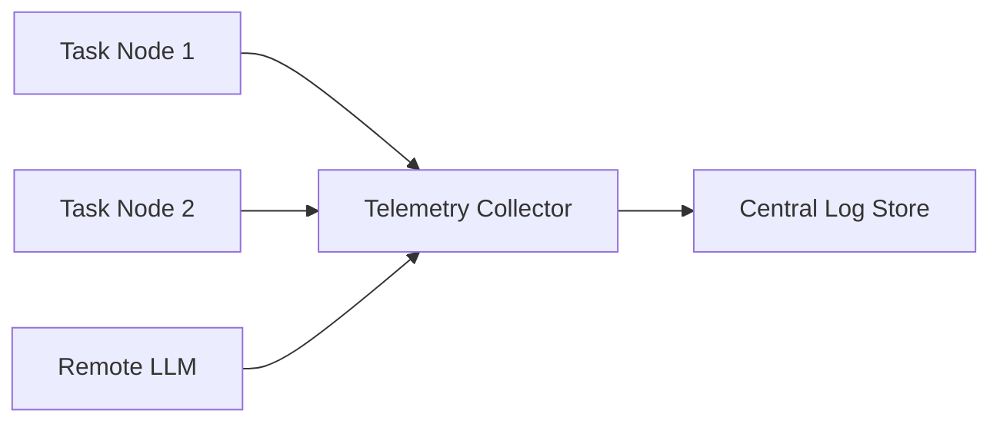

# Telemetry and Observability

KORA is a structural system.

Structure without observability degrades into assumption.
 Telemetry in KORA is not optional instrumentation.

It is a structural requirement.

---

## 1. Purpose

Observability enables:

- Cost transparency
- Latency profiling
- Decomposition effectiveness measurement
- Budget enforcement auditing
- Experimental falsifiability

Without telemetry, structural claims cannot be verified.

---

## 2. Telemetry Model

Each Task emits structured telemetry events.

Core event lifecycle:

 Each stage produces structured log entries.

---

## 3. Task-Level Metrics

Each task must record:

| Metric | Description |
|---------|-------------|
| task_id | Unique task identifier |
| task_type | deterministic, model, aggregation |
| start_time | Execution start timestamp |
| end_time | Execution end timestamp |
| duration_ms | Execution duration |
| model_used | Model backend if applicable |
| tokens_in | Input tokens consumed |
| tokens_out | Output tokens generated |
| retries | Retry count |
| validation_status | success or failure |

Telemetry is per-task, not per-request only.
 Atomic observability preserves structure.

---

## 4. Request-Level Metrics

Aggregated across entire task graph:

| Metric | Description |
|---------|-------------|
| total_tasks | Number of tasks executed |
| model_invocations | Count of model tasks |
| deterministic_tasks | Count of deterministic tasks |
| total_tokens | Sum of tokens consumed |
| total_latency_ms | End-to-end latency |
| total_retries | Total retries across graph |
| failure_count | Number of task failures |

Request-level metrics support break-even analysis.

---

## 5. Cost Accounting Model

Total request cost is computed as:

C_total = Σ(model_token_cost) + Σ(structural_overhead)

Where:

model_token_cost = tokens_in + tokens_out multiplied by pricing model.

Structural overhead includes:

- DAG validation cost
- Schema validation cost
- Deterministic execution cost

Cost must be decomposable per task.

---

## 6. Latency Profiling

Latency is decomposed into:

| Component | Description |
|-----------|-------------|
| T_construct | Task construction time |
| T_dag | DAG validation time |
| T_det | Deterministic execution time |
| T_model | Model invocation time |
| T_validation | Schema validation time |
| T_aggregation | Aggregation time |

Total latency:

T_total = T_construct + T_dag + T_det + T_model + T_validation + T_aggregation

Latency analysis is structural, not monolithic.

---

## 7. Failure Classification

Failures must be categorized explicitly.

| Failure Type | Description |
|---------------|-------------|
| ValidationFailure | Schema mismatch |
| TimeoutFailure | Exceeded max_time_ms |
| BudgetFailure | Exceeded max_tokens |
| DependencyFailure | Upstream task failure |
| ExecutionFailure | Deterministic execution error |
| RoutingFailure | Backend invocation failure |

Each failure type must emit telemetry event.

No silent failure.

---

## 8. Retry Tracking

Retry events include:

- Retry attempt number
- Cause of retry
- Model used in retry
- Remaining budget

Retries must be auditable.

Repeated retries signal decomposition or schema issues.

---

## 9. Routing Observability

When routing decisions occur, log:

- Task id
- Selected backend
- Alternative candidates
- Policy decision reason

This ensures routing neutrality remains visible.

Routing must be explainable.

---

## 10. Distributed Execution Telemetry

In distributed environments, telemetry must include:

- Node identifier
- Execution location
- Network latency
- Serialization overhead

Distributed telemetry preserves cross-node visibility.

---

## 11. Observability Invariants

The system must guarantee:

- **Every task emits telemetry**
- **Every model invocation is logged**
- **Every failure is classified**
- **Every retry is recorded**
- **Every routing decision is traceable**

No silent execution.

---

## 12. Experimental Measurement

Telemetry supports falsifiable evaluation:

- Invocation reduction measurement
- Token savings quantification
- Overhead calculation
- Retry stability assessment
- Decomposition coverage analysis

Structure is measurable only if telemetry is complete.

---

## 13. Storage and Retention

Telemetry storage must:

- Support structured querying
- Preserve task relationships
- Allow correlation by trace_id
- Retain historical experiments

Retention policy must balance audit needs and storage cost.

---

## 14. Performance Implications

Telemetry introduces overhead.

Logging must:

- Be non-blocking
- Avoid synchronous I/O in critical path
- Batch writes when possible
- Respect global budget constraints

Observability must not dominate execution.

---

## Closing Position

Telemetry is not decoration.

It is enforcement.

Without telemetry:

- Budget governance cannot be audited.
- Break-even cannot be measured.
- Decomposition cannot be validated.
- Routing cannot be trusted.

**Structure must be observable.**
