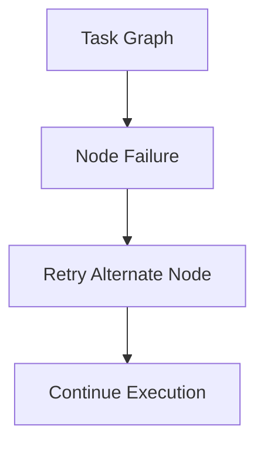

# Testing and Validation Strategy

KORA is a structural architecture.

Structural claims must be validated continuously.

Testing is not only about correctness.  
It is about preserving invariants.

---

## 1. Testing Philosophy

Testing in KORA must verify:

- Deterministic-first execution
- Budget enforcement
- Schema validation
- Routing neutrality
- Task isolation
- Telemetry completeness

Tests must fail if invariants weaken.

---

## 2. Deterministic Layer Tests

Deterministic tasks must be:

- Pure
- Reproducible
- Side-effect free

Testing requirements:

- Unit tests per deterministic task
- Boundary condition tests
- Performance consistency tests
- Idempotence verification

Deterministic execution must never invoke model layer.

---

## 3. Model Layer Tests

Model-bound tasks require validation tests:

- Budget enforcement tests
- Retry boundary tests
- Schema validation tests
- Escalation logic tests

Test case examples:

- Exceed max_tokens
- Exceed max_time_ms
- Exceed max_retries
- Malformed model output

Model invocation must never bypass budget or schema.

---

## 4. Schema Validation Tests

For each Task IR schema:

- Valid output must pass.
- Invalid output must fail.
- additionalProperties must be rejected.
- Missing required fields must fail.

Schema enforcement is structural boundary.

No best-effort parsing allowed.

---

## 5. Task IR Validation Tests

Task IR must be validated before execution.

Tests must include:

- Missing required fields
- Invalid task types
- Cyclic dependency detection
- Version mismatch handling

Invalid Task IR must never execute.

---

## 6. DAG Validation Tests

DAG engine must detect:

- Cycles
- Missing dependencies
- Invalid task references
- Multiple aggregation conflicts

Graph integrity is foundational.

---

## 7. Budget Enforcement Tests

Budget must be tested across:

- Model invocation
- Retry loops
- Distributed nodes
- Aggregation stage

Simulated over-budget tasks must terminate deterministically.

---

## 8. Routing Policy Tests

Routing decisions must be validated:

- Deterministic tasks never routed to model
- Model tasks routed according to policy
- Escalation respects budget
- Node capability respected

Routing must be predictable.

---

## 9. Distributed Execution Tests

In distributed mode:

- Simulate node failure
- Simulate network latency
- Simulate timeout
- Simulate partial graph failure

Atomic failure must not collapse full graph.

Failure isolation must be preserved.

---

## 10. Failure Injection Testing

Failure injection must simulate:

- Model hallucinated structure
- Schema corruption
- Budget exhaustion
- Routing misconfiguration

Failure injection validates resilience.

---

## 11. Performance Regression Testing

Performance tests must track:

- Invocation count per request
- Token usage trends
- Latency distribution
- Structural overhead trends

Regression threshold must be defined.

If invocation count increases without justification, test must fail.

---

## 12. Telemetry Completeness Testing

Telemetry tests must verify:

- Every task emits start and end events.
- Model invocation metrics recorded.
- Retry attempts logged.
- Routing decisions logged.

No silent execution allowed.

---

## 13. Falsifiability Validation

Benchmark tests must validate:

- Reduction in invocation count
- No degradation in correctness
- Structural overhead within bounds

Falsifiable claims must be continuously re-tested.

---

## 14. CI/CD Integration

Continuous integration must include:

- Deterministic test suite
- Model-layer simulation tests
- Schema validation suite
- DAG validation suite
- Budget enforcement suite

No merge allowed if structural invariants break.

---

## 15. Structural Guarantees Under Test

The following must always be verified:

- **No hidden inference**
- **No unbounded retry**
- **No schema bypass**
- **No cycle in DAG**
- **No silent routing escalation**

If any test weakens these, architecture is compromised.

---

## Closing Position

Testing is enforcement.

KORA does not rely on intention.

It relies on invariants protected by tests.

**Structure must be verified continuously.**
