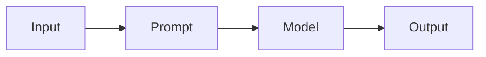
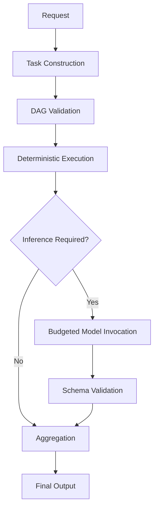
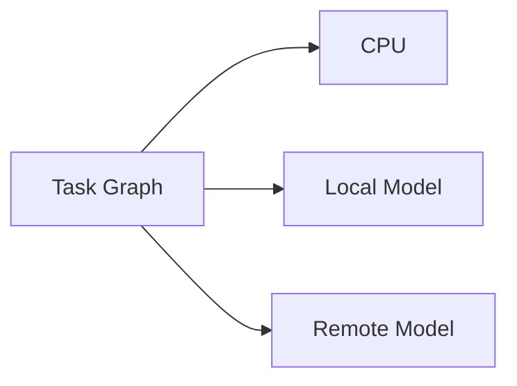
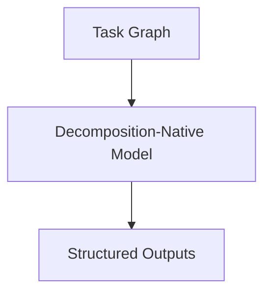

# KORA: An Inference-First Execution Architecture

## Abstract

KORA is an execution architecture that separates task necessity from probabilistic reasoning. Modern AI systems are largely inference-reflexive: they invoke large language models for every request, regardless of structural complexity. This design leads to unnecessary computation, unpredictable latency, and centralized infrastructure dependence.

KORA introduces three architectural principles:

1. Determinism before inference.
2. Native task decomposition.
3. Compute neutrality through heterogeneous routing.

This paper formalizes the structural critique, presents the execution model, derives break-even conditions, and outlines a research direction toward Decomposition-Native Foundation Models.

---

## 1. Introduction

Large language models have demonstrated impressive reasoning capability. However, most production systems integrate them in a reflexive manner. Every request triggers model invocation. The architecture does not discriminate between trivial and reasoning-intensive tasks.

This pattern is convenient but structurally inefficient.

The core issue is not model capability. It is invocation discipline.

KORA proposes an execution architecture that enforces structure before reasoning.

---

## 2. Structural Critique

In inference-reflexive systems:

 
Two logically distinct decisions are collapsed:
 

1. Is reasoning necessary?
2. What is the reasoning result?

When necessity is not evaluated, deterministic operations are solved probabilistically.  This increases cost and latency while centralizing compute.

The critique is architectural, not model-level.

---

## 3. Architectural Principles

### 3.1 Determinism Before Inference

Trivial or rule-based tasks execute without invoking a model.
 This reduces hallucination risk and preserves bounded latency.

### 3.2 Native Decomposition

Complex requests are decomposed into atomic tasks.

Each task is:

- Explicitly typed
- Budget-bound
- Schema-validated
- Independently executable

Reasoning becomes compositional.

### 3.3 Compute Neutrality

Tasks can route across:

- CPUs
- Local lightweight models
- Remote LLM APIs
- Future NPUs

Heterogeneous compute is architectural, not incidental.

---

## 4. Execution Model

 
Execution is graph-based, not prompt-based.

The model is one stage in the lifecycle.

---

## 5. Break-Even Formalization

Let:

| Symbol | Meaning |
|--------|----------|
| T      | Total requests |
| P      | Deterministic proportion |
| C_m    | Cost per model call |
| O      | Structural overhead |

Baseline cost:

C_baseline = C_m * T

Structured cost:

C_kora = C_m * (1 - P) * T + O * T

KORA is beneficial when:

P * C_m > O

This inequality is empirically testable.

---

## 6. Benchmark Evidence

In controlled experiments:

| Metric      | Direct | KORA | Reduction |
|-------------|--------|------|-----------|
| LLM Calls   | 2      | 1    | -50%      |
| Tokens In   | 359    | 225  | -37%      |
| Tokens Out  | 121    | 85   | -30%      |

Output equivalence was preserved.

This demonstrates that structured execution reduces invocation frequency without degrading capability.

---

## 7. Budget Governance

Model invocation must satisfy explicit constraints:

- max_tokens
- max_time_ms
- max_retries

Budget is contractual.

Unbounded inference is structurally disallowed.

---

## 8. Decentralized Compute Implications

Monolithic prompts require centralized accelerators.

Decomposed tasks enable routing:

 
Because reasoning units are smaller and bounded, routing becomes flexible.

CPU becomes first-class rather than fallback.

---

## 9. Falsifiability

KORA makes a conditional claim:

If deterministic proportion P is meaningful and structural overhead O is controlled, structured execution reduces cost without reducing correctness.

Failure conditions include:

- Overhead exceeding savings
- Decomposition degrading output quality
- Budget governance increasing latency excessively

KORA remains valid only under empirical verification.

---

## 10. Toward Decomposition-Native Foundation Models

Current models are prompt-native.

Future models may accept structured task graphs directly.

 
Such models could internalize task boundaries and budget awareness.

KORA prepares the architectural substrate for this evolution.

---

## 11. Conclusion

KORA does not attempt to outperform models.

It restructures how they are invoked.

The central thesis is simple:

**Structure precedes scale.**

By separating necessity from reasoning, enforcing budget governance, and enabling heterogeneous routing, KORA transforms inference from reflex into discipline.

The architectural shift is modest in implementation but fundamental in implication.
